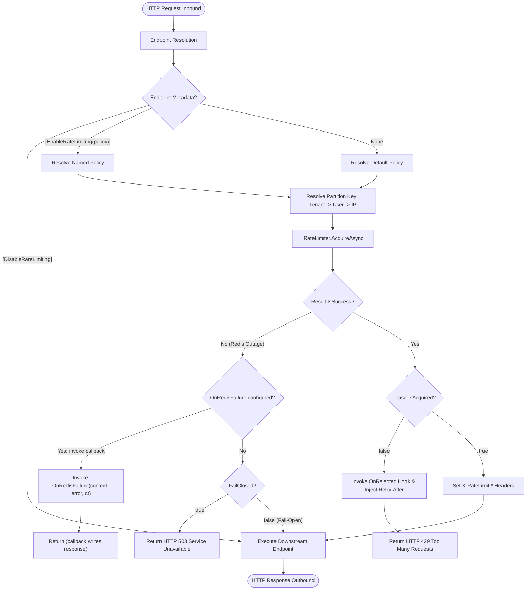

# EricksonLopez.RateLimiting

High-throughput, distributed, zero-allocation rate limiting engine and ASP.NET Core middleware for modern .NET.

[](https://github.com/ericksonlopezf/dotnet-ratelimiting/actions)
[](https://codecov.io/gh/ericksonlopezf/dotnet-ratelimiting)
[](https://sonarcloud.io/summary/new_code?id=ericksonlopezf_dotnet-ratelimiting)
[](https://github.com/ericksonlopezf/dotnet-ratelimiting/blob/main/docs/testing-roadmap.md)
[](https://www.nuget.org/packages/EricksonLopez.RateLimiting)
[](https://www.nuget.org/packages/EricksonLopez.RateLimiting)
[](https://github.com/ericksonlopezf/dotnet-ratelimiting/blob/main/LICENSE)
[](https://dotnet.microsoft.com)
[](https://learn.microsoft.com/en-us/dotnet/core/deploying/native-aot)

`EricksonLopez.RateLimiting` is an enterprise-grade inbound traffic flow control and rate limiting ecosystem engineered for modern, horizontally scaled .NET 8.0, 9.0, and 10.0 microservices and cloud APIs. Built around a unified `IRateLimiter` abstraction returning `ValueTask<Result<RateLimitLease>>`, it eliminates GC pressure on high-frequency API gateways through zero-allocation `readonly record struct` leases and eliminates cascading infrastructure failures with deterministic Fail-Open or Fail-Closed degradation. With atomic single-round-trip Redis Lua scripts, zero-reflection Native AOT compilation, and native OpenTelemetry metrics, it provides deterministic capacity management for high-load multi-tenant architectures.

---

## Table of Contents

- [What Problem It Solves](#-what-problem-it-solves)
- [Key Features](#-key-features)
- [Ecosystem](#-ecosystem)
- [Documentation](#-documentation)
  - [Step-by-Step Interactive Showcase (Levels 00 to 10)](#-step-by-step-interactive-showcase-levels-00-to-10)
  - [Technical Reference & Architecture Guides](#-technical-reference--architecture-guides)
  - [Architectural Decision Records (ADRs)](#-architectural-decision-records-adrs)
  - [Runnable Demonstrations & Sample Applications](#-runnable-demonstrations--sample-applications)
- [Installation](#-installation)
  - [1. Core In-Memory Engine (Required)](#1-core-in-memory-engine-required)
  - [2. ASP.NET Core Middleware & Endpoint Conventions](#2-aspnet-core-middleware--endpoint-conventions)
  - [3. Distributed Redis Rate Limiting Provider](#3-distributed-redis-rate-limiting-provider)
  - [4. Direct PackageReference (Project File)](#4-direct-packagereference-project-file)
- [Quick Start](#-quick-start)
  - [1. Basic In-Memory Limiter & Direct Acquisition](#1-basic-in-memory-limiter--direct-acquisition)
  - [2. ASP.NET Core Pipeline & Minimal API Protection](#2-aspnet-core-pipeline--minimal-api-protection)
  - [3. Distributed Redis Coordination (Sliding Window & Token Bucket)](#3-distributed-redis-coordination-sliding-window--token-bucket)
  - [4. Zero-Allocation Struct Leases & Pattern Matching](#4-zero-allocation-struct-leases--pattern-matching)
  - [5. Resilient Fail-Open & RFC 7807 Problem Details](#5-resilient-fail-open--rfc-7807-problem-details)
- [Core Use Cases](#-core-use-cases)
  - [Use Case 1: Multi-Tier API Gateway with Named Policies & Endpoint Routing](#use-case-1-multi-tier-api-gateway-with-named-policies--endpoint-routing)
  - [Use Case 2: Multi-Tenant SaaS Isolation & Hierarchical Partitioning](#use-case-2-multi-tenant-saas-isolation--hierarchical-partitioning)
  - [Use Case 3: High-Availability Edge Microservices with Resilient Fail-Open Degradation](#use-case-3-high-availability-edge-microservices-with-resilient-fail-open-degradation)
  - [Use Case 4: Resource-Intensive Worker Throttling with Concurrency Limiter](#use-case-4-resource-intensive-worker-throttling-with-concurrency-limiter)
  - [Use Case 5: Multi-Interval Quota Protection with Composite Limiter](#use-case-5-multi-interval-quota-protection-with-composite-limiter)
  - [Use Case 6: Clean Architecture & CQRS Pipeline Throttling with Cancellation Support](#use-case-6-clean-architecture--cqrs-pipeline-throttling-with-cancellation-support)
- [Configuration & Integrations](#-configuration--integrations)
  - [ASP.NET Core Middleware Options](#aspnet-core-middleware-options)
  - [Standard HTTP Rate Limiting Headers](#standard-http-rate-limiting-headers)
  - [OpenTelemetry Metrics Integration](#opentelemetry-metrics-integration)
  - [Native AOT & Trimming Compatibility](#native-aot--trimming-compatibility)
  - [Distributed Redis Configuration](#distributed-redis-configuration)
  - [Fluent Policy Registry & Endpoint Conventions](#fluent-policy-registry--endpoint-conventions)
- [Testing & Quality](#-testing--quality)
  - [Quality Gates Matrix](#quality-gates-matrix)
  - [Deterministic Unit Testing with TimeProvider & FakeTimeProvider](#deterministic-unit-testing-with-timeprovider--faketimeprovider)
  - [Architecture Fitness Functions (NetArchTest)](#architecture-fitness-functions-netarchtest)
  - [Mutation Testing Certification (Stryker.NET)](#mutation-testing-certification-strykernet)
- [Performance Benchmarks](#-performance-benchmarks)
  - [Primary In-Memory Hot-Path Benchmark](#primary-in-memory-hot-path-benchmark)
  - [Architectural Zero-Allocation Mechanics](#architectural-zero-allocation-mechanics)
- [Compatibility & Technical Matrix](#-compatibility--technical-matrix)
  - [Target Framework & Runtime Support](#target-framework--runtime-support)
  - [Error Codes & HTTP Mapping Matrix](#error-codes--http-mapping-matrix)
- [Architecture & Design Principles](#-architecture--design-principles)
  - [Inbound HTTP Middleware Pipeline Flow](#inbound-http-middleware-pipeline-flow)
  - [Partition Key Resolution Hierarchy](#partition-key-resolution-hierarchy)
  - [Resilient Degradation State Machine](#resilient-degradation-state-machine)
  - [Core Architectural Invariants](#core-architectural-invariants)
- [Best Practices & Anti-Patterns](#-best-practices--anti-patterns)
- [Troubleshooting & Common Pitfalls](#-troubleshooting--common-pitfalls)
- [Part of the Ecosystem](#-part-of-the-ecosystem)
- [Contributing](#-contributing)
  - [Prerequisites](#prerequisites)
  - [Local Development Workflow](#local-development-workflow)
  - [Community & Governance Resources](#community--governance-resources)
- [License](#-license)

---

## 🎯 What Problem It Solves

In modern cloud-native architectures running on Kubernetes, rate limiting must be **atomic across distributed pods**, **safe against infrastructure outages**, and **free from garbage collection pauses**. Standard .NET primitives (`System.Threading.RateLimiting` and `Microsoft.AspNetCore.RateLimiting`) and legacy libraries force severe trade-offs in distributed enterprise environments:

### Traditional Pain Points & Flaws

1. **The In-Process Limitation of Standard BCL (`System.Threading.RateLimiting`)**: Standard BCL primitives provide zero distributed coordination out of the box. In Kubernetes clusters running $N$ container pods behind a load balancer, each pod maintains its own isolated in-memory counter. A tenant's allowed quota is multiplied by $N$, enabling quota evasion via simple round-robin traffic distribution.
2. **Hot-Path Heap Allocations and GC Pressure**: In the BCL, `RateLimitLease` is an abstract class requiring heap allocation on Gen 0 for every evaluation. At 50,000+ req/sec at an edge API gateway or ingress middleware, this continuous object churn triggers frequent Gen 0/Gen 1 GC pauses, introducing latency spikes and degrading p99 responsiveness.
3. **Race Conditions and Window Boundary Drift in Distributed Limiters**: Ad-hoc distributed limiters use naive Redis `INCR` + `EXPIRE` commands across multiple network round-trips. This introduces window transition races, key-expiration drift, and 2x burst leaking at interval boundaries.
4. **Brittle Infrastructure and Unhandled Exception Panics**: When Redis clusters experience network blips, failovers, or socket timeouts, conventional distributed libraries throw unhandled `RedisException` or `TimeoutException` instances, causing sudden HTTP 500 server crashes instead of resilient degradation.
5. **Naive IP Throttling**: Simple IP throttling penalizes entire corporate networks, university campuses, or mobile networks sharing NAT gateways or corporate egress proxies, instead of isolating specific authenticated users or tenants.

### How `EricksonLopez.RateLimiting` Solves This

- **Atomic Single Round-Trip Redis Lua Scripting**: Evaluates permits, prunes expired events, and computes mathematically exact `Retry-After` timestamps within a single atomic Lua script over Redis Sorted Sets (`ZSET`) or Hashes (`HSET`), eliminating multi-step race conditions.
- **Zero-Allocation Lease Value Type**: `RateLimitLease` is modeled as an immutable `readonly record struct` passed via CPU registers and stack frames (0 bytes allocated on the managed heap per check).
- **Railway-Oriented Resilience (`Result<RateLimitLease>`)**: Infrastructure faults return typed `Result.Failure(RateLimitErrors.ConnectionFailed)` instead of throwing exceptions, enabling deterministic **Fail-Open** or **Fail-Closed** degradation without crashing processes.
- **Hierarchical Multi-Tenant Partitioning**: Enforces strict identity resolution in order: Subject ID (Authenticated User) $\to$ Tenant ID (Organization) $\to$ IP Address (Anonymous Traffic).
- **Certified Native AOT & Trimming**: Built from the ground up with `<IsAotCompatible>true</IsAotCompatible>` and zero reflection on hot paths.

### Architectural Comparison Profile

| Feature | `EricksonLopez.RateLimiting` | BCL (`System.Threading.RateLimiting`) | `AspNetCoreRateLimit` | `RedisRateLimiting` |
|:---|:---:|:---:|:---:|:---:|
| **Distributed Multi-Pod Coordination** | ✅ Atomic Redis (1 round-trip Lua) | ❌ In-memory only | ⚠️ Non-atomic Redis (INCR+EXPIRE race) | ✅ Redis Lua |
| **Failure Degradation Model** | ✅ Explicit Railway `Result<T>` & Fail-Open | ❌ Unhandled exceptions | ❌ Silent failure / unhandled | ❌ Throws `RedisException` |
| **Hot-Path Allocations** | ✅ **0 bytes** for single-algorithm limiters (`readonly record struct`); `CompositeRateLimiter` allocates one small fixed-size array per call | ⚠️ Heap allocation per check | ⚠️ Multiple allocations | ⚠️ Heap allocation (`RateLimitLease` class) |
| **Native AOT & Trimming** | ✅ 100% Verified & Certified | ✅ Verified | ❌ Incompatible (Reflection/JSON) | ⚠️ Unverified |
| **TimeProvider Testability** | ✅ Injected `TimeProvider` | ✅ Supported | ❌ Untestable (wall clock) | ❌ Untestable |
| **Named Policies & Endpoint Routing** | ✅ Fluent builder + Attributes | ✅ Supported | ⚠️ JSON file-based | ⚠️ Extension wrapper |
| **OpenTelemetry Metrics Built-in** | ✅ `System.Diagnostics.Metrics` | ⚠️ BCL standard only | ❌ None | ❌ None |

---

## ⚡ Key Features

- ⚡ **Zero-Allocation Hot Path**: `readonly record struct RateLimitLease` producing **0 B heap allocation** per lease evaluation for single-algorithm limiters (SlidingWindow, TokenBucket, FixedWindow, Concurrency). `CompositeRateLimiter` allocates one fixed-size array per call — see [allocation characteristics](#-performance-benchmarks).
- 🔄 **Atomic Single Round-Trip Redis Lua Engine**: Precompiled SHA-1 Lua scripts for Sliding Window and Token Bucket eliminate multi-pod concurrency races.
- 🛡️ **Railway-Oriented Resilience**: Infrastructure failures surface as typed `Result.Failure(Error)` values with configurable Fail-Open or Fail-Closed posture.
- 📦 **Complete Algorithm Suite**:
  - **Sliding Window** (`SlidingWindowRateLimiter`): Segmented circular ring buffer preventing 2x boundary bursts.
  - **Token Bucket** (`TokenBucketRateLimiter`): Fractional microsecond continuous replenishment for burst-tolerant flows.
  - **Fixed Window** (`FixedWindowRateLimiter`): High-throughput discrete quota counter for calendar-aligned intervals.
  - **Concurrency Limiter** (`ConcurrencyRateLimiter`): Lock-free atomic CAS restriction with deterministic `IDisposable` lease release.
  - **Composite Multi-Interval Limiter** (`CompositeRateLimiter`): Cascading AND-logic composition with automatic permit rollback upon downstream rejection. Allocates one fixed-size array per call (see benchmark notes).
- 🏷️ **Named Policies & Minimal API Conventions**: Fluent builder `AddRateLimiting(policies => ...)` with `.RequireRateLimiting("policy")` and attributes.
- ⏱️ **First-Class TimeProvider Injection**: Fully testable and deterministic unit testing via `FakeTimeProvider` without wall-clock sleep delays.
- 📊 **Built-in OpenTelemetry Observability**: Native BCL `System.Diagnostics.Metrics.Meter` emitting `rate_limit.requests.total` and `rate_limit.lease.duration` with zero external dependencies.
- 🌐 **100% Native AOT & Trim-Safe**: Certified under `<IsAotCompatible>true</IsAotCompatible>` with zero reflection or dynamic code emission.

---

## 📦 Ecosystem

The solution is partitioned into three decoupled packages adhering to strict single responsibility and zero circular dependencies:

| Package | Version | Description |
|---|---|---|
| [`EricksonLopez.RateLimiting`](https://www.nuget.org/packages/EricksonLopez.RateLimiting) | [](https://www.nuget.org/packages/EricksonLopez.RateLimiting) | Core Tier 0 abstractions, in-memory algorithms (Sliding Window, Token Bucket, Fixed Window, Concurrency, Composite), Named Policy Registry, and OpenTelemetry instrumentation. |
| [`EricksonLopez.RateLimiting.AspNetCore`](https://www.nuget.org/packages/EricksonLopez.RateLimiting.AspNetCore) | [](https://www.nuget.org/packages/EricksonLopez.RateLimiting.AspNetCore) | HTTP Tier 1 middleware, standard `X-RateLimit-*` response headers, endpoint conventions (`RequireDistributedRateLimiting`), and attributes. |
| [`EricksonLopez.RateLimiting.Redis`](https://www.nuget.org/packages/EricksonLopez.RateLimiting.Redis) | [](https://www.nuget.org/packages/EricksonLopez.RateLimiting.Redis) | Distributed Tier 1 Sliding Window (ZSET) and Token Bucket (Hash) limiters backed by StackExchange.Redis using atomic single round-trip Lua scripts. |

---

## 📚 Documentation

> 🌐 **Official Documentation Hub:** [https://github.com/ericksonlopezf/dotnet-ratelimiting/tree/main/docs](https://github.com/ericksonlopezf/dotnet-ratelimiting/tree/main/docs)

### 🎓 Step-by-Step Interactive Showcase (Levels 00 to 10)

The official reference showcase is organized into 11 progressive pedagogical levels available in [samples/Showcase](https://github.com/ericksonlopezf/dotnet-ratelimiting/tree/main/samples/Showcase):

| Level | Topic | Description |
|---|---|---|
| [**Level 00**](https://github.com/ericksonlopezf/dotnet-ratelimiting/blob/main/samples/Showcase/docs/00-repository-discovery.md) | **Conceptual & Architectural Foundation** | Core architectural principles, zero-allocation struct leases, and comparison vs BCL |
| [**Level 01**](https://github.com/ericksonlopezf/dotnet-ratelimiting/blob/main/samples/Showcase/docs/03-progressive-showcase.md#level-1--quick-start) | **Quick Start & Minimal Configuration** | In-memory DI registration, direct instantiation, and `Result<T>` envelope handling |
| [**Level 02**](https://github.com/ericksonlopezf/dotnet-ratelimiting/blob/main/samples/Showcase/docs/03-progressive-showcase.md#level-2--comprehensive-configuration) | **Comprehensive Configuration** | Full options parameterization (Fixed, Sliding, Token Bucket, Concurrency, Middleware, Redis) |
| [**Level 03**](https://github.com/ericksonlopezf/dotnet-ratelimiting/blob/main/samples/Showcase/docs/03-progressive-showcase.md#level-3--real-world-partitioning-use-cases) | **Real-World Partitioning** | Remote IP, authenticated Claims (`sub`), and multi-tenant organization key resolvers |
| [**Level 04**](https://github.com/ericksonlopezf/dotnet-ratelimiting/blob/main/samples/Showcase/docs/03-progressive-showcase.md#level-4--advanced-policy-integration-named-policies--minimal-apis) | **Advanced Named Policies** | Fluent `RateLimiterPolicyBuilder`, named policy registry, and Minimal API endpoint conventions |
| [**Level 05**](https://github.com/ericksonlopezf/dotnet-ratelimiting/blob/main/samples/Showcase/docs/03-progressive-showcase.md#level-5--concurrency-throttling--safe-disposal) | **Concurrency Throttling** | In-flight execution limits with lock-free atomic CAS loops and deterministic `using var lease` disposal |
| [**Level 06**](https://github.com/ericksonlopezf/dotnet-ratelimiting/blob/main/samples/Showcase/docs/03-progressive-showcase.md#level-6--error-handling-resilience--fallback) | **Error Handling & Resilience** | RFC 7807 ProblemDetails responses, Fail-Open vs Fail-Closed modes, and `OnRedisFailure` hooks |
| [**Level 07**](https://github.com/ericksonlopezf/dotnet-ratelimiting/blob/main/samples/Showcase/docs/03-progressive-showcase.md#level-7--scalability--opentelemetry-metrics) | **Scalability & Observability** | Native OpenTelemetry metrics (`System.Diagnostics.Metrics.Meter`, requests counter, duration histogram) |
| [**Level 08**](https://github.com/ericksonlopezf/dotnet-ratelimiting/blob/main/samples/Showcase/docs/03-progressive-showcase.md#level-8--custom-extensibility) | **Custom Extensibility** | Implementing custom rate limiters adhering to the `IRateLimiter` contract |
| [**Level 09**](https://github.com/ericksonlopezf/dotnet-ratelimiting/blob/main/samples/Showcase/docs/03-progressive-showcase.md#level-9--distributed-redis-limiters) | **Distributed Redis Limiters** | Atomic single-round-trip Lua scripts for Sliding Window (ZSET) and Token Bucket (Hash) |
| [**Level 10**](https://github.com/ericksonlopezf/dotnet-ratelimiting/blob/main/samples/Showcase/docs/03-progressive-showcase.md#level-10--enterprise-architecture--multi-tier-composition) | **Enterprise Multi-Tier Composition** | Cascading `CompositeRateLimiter` with AND-logic and automatic permit rollback |

### 📖 Technical Reference & Architecture Guides

- [**Architectural Justification**](https://github.com/ericksonlopezf/dotnet-ratelimiting/blob/main/docs/architectural-justification.md) — Fundamental invariants, Tier 4 edge protection boundaries, and memory layouts.
- [**CI/CD Pipeline & Quality Gates**](https://github.com/ericksonlopezf/dotnet-ratelimiting/blob/main/docs/ci-cd-pipeline.md) — Build automation, multi-stage matrix, Stryker mutation gate, and benchmark regression enforcement.
- [**NuGet Packages Reference**](https://github.com/ericksonlopezf/dotnet-ratelimiting/blob/main/docs/nuget-packages.md) — Complete package matrix, dependency graph, target frameworks, and public API surface.
- [**Hot-Path Allocation Profile**](https://github.com/ericksonlopezf/dotnet-ratelimiting/blob/main/docs/benchmarks/hot-path-allocation-profile.md) — Empirical memory profiling, struct leases, and 0 B allocation proofs.
- [**Competitive Functional Parity Audit**](https://github.com/ericksonlopezf/dotnet-ratelimiting/blob/main/docs/functional-parity-audit.md) — Comprehensive competitive analysis vs BCL, AspNetCoreRateLimit, and RedisRateLimiting.
- [**Product Strategy**](https://github.com/ericksonlopezf/dotnet-ratelimiting/blob/main/docs/product-strategy.md) — Product vision, developer audience, strategic differentiators, and ecosystem positioning.
- [**Framework Testing Roadmap**](https://github.com/ericksonlopezf/dotnet-ratelimiting/blob/main/docs/testing-roadmap.md) — Unit of work coverage matrix, Stryker mutation scores, and equivalent mutant certifications.
- [**Public API Inventory**](https://github.com/ericksonlopezf/dotnet-ratelimiting/blob/main/samples/Showcase/docs/01-public-api-inventory.md) — Exhaustive catalog of all classes, interfaces, records, and extensions.
- [**Functional Map & Request Flows**](https://github.com/ericksonlopezf/dotnet-ratelimiting/blob/main/samples/Showcase/docs/02-functional-map.md) — End-to-end request lifecycle and layer transition specifications.
- [**Official Cookbook & Recipes**](https://github.com/ericksonlopezf/dotnet-ratelimiting/blob/main/samples/Showcase/docs/04-cookbook.md) — Production recipes for brute-force defense, multi-tier quotas, and fail-open.
- [**Technical API Reference**](https://github.com/ericksonlopezf/dotnet-ratelimiting/blob/main/samples/Showcase/docs/05-api-reference.md) — Microsoft Learn style reference for every public method.
- [**Operational & Troubleshooting Guides**](https://github.com/ericksonlopezf/dotnet-ratelimiting/blob/main/samples/Showcase/docs/07-guides-and-troubleshooting.md) — Operational best practices, failure diagnosis, and migration recipes.

### 🏛️ Architectural Decision Records (ADRs)

| ADR | Title | Key Decision |
|---|---|---|
| [**ADR-001**](https://github.com/ericksonlopezf/dotnet-ratelimiting/blob/main/docs/adr/adr-001-distributed-rate-limiting.md) | Distributed Rate Limiting | Adopt atomic Redis Lua scripting over sorted sets to eliminate multi-pod race conditions. |
| [**ADR-002**](https://github.com/ericksonlopezf/dotnet-ratelimiting/blob/main/docs/adr/adr-002-package-existence-justification.md) | Package Existence & Invariant Justification | Autonomous Tier 4 Edge Protection ownership in adherence with Ecosystem Principles 14 & 15. |
| [**ADR-003**](https://github.com/ericksonlopezf/dotnet-ratelimiting/blob/main/docs/adr/adr-003-named-rate-limiting-policies-and-endpoint-routing.md) | Named Policies and Endpoint Routing | Fluent policy registry with evaluation precedence: Endpoint Metadata > Default Policy > Container. |
| [**ADR-004**](https://github.com/ericksonlopezf/dotnet-ratelimiting/blob/main/docs/adr/adr-004-resilient-degradation-and-middleware-callbacks.md) | Resilient Degradation & Middleware Callbacks | Railway-oriented `Result<RateLimitLease>` with configurable Fail-Open default and `OnRedisFailure` hooks. |
| [**ADR-005**](https://github.com/ericksonlopezf/dotnet-ratelimiting/blob/main/docs/adr/adr-005-opentelemetry-metrics-and-observability.md) | OpenTelemetry Metrics and Observability | Zero-allocation `System.Diagnostics.Metrics.Meter` instrumentation emitting requests and lease duration. |
| [**ADR-006**](https://github.com/ericksonlopezf/dotnet-ratelimiting/blob/main/docs/adr/adr-006-concurrency-rate-limiting.md) | Concurrency Rate Limiting & Zero-Allocation Lease Disposal | Lock-free CAS loop with deterministic `IDisposable` lease release without heap allocations. |
| [**ADR-007**](https://github.com/ericksonlopezf/dotnet-ratelimiting/blob/main/docs/adr/adr-007-composite-and-multi-interval-rate-limiting.md) | Composite and Multi-Interval Rate Limiting | Cascading AND-logic composition with automatic permit rollback upon downstream limiter rejection. |
| [**ADR-008**](https://github.com/ericksonlopezf/dotnet-ratelimiting/blob/main/docs/adr/adr-008-distributed-redis-token-bucket.md) | Distributed Redis Token Bucket | Atomic Redis hash-based token bucket supporting continuous fractional microsecond token replenishment. |
| [**ADR-009**](https://github.com/ericksonlopezf/dotnet-ratelimiting/blob/main/docs/adr/adr-009-partition-lifecycle-and-security-hardening.md) | Bounded Partition Lifecycle & Security Hardening | Bounded collections via `MaxPartitions`, idle pruning, overflow-safe arithmetic, `OneShotDisposer`, and cryptographic GUID salt. |

### 🧩 Runnable Demonstrations & Sample Applications

Explore complete, runnable sample projects in the official repository:

| Sample Project | Focus Area | Description |
|---|---|---|
| [**Showcase**](https://github.com/ericksonlopezf/dotnet-ratelimiting/tree/main/samples/Showcase) | **Complete Reference** | Full 11-level executable demonstration of all algorithms, configurations, and observability. |
| [**SlidingWindow.Sample**](https://github.com/ericksonlopezf/dotnet-ratelimiting/tree/main/samples/SlidingWindow.Sample) | **In-Memory Smoothing** | In-memory sliding window rate limiting with ASP.NET Core middleware and endpoint bypass exemptions. |
| [**Redis.MultiTenant.Sample**](https://github.com/ericksonlopezf/dotnet-ratelimiting/tree/main/samples/Redis.MultiTenant.Sample) | **Distributed Multi-Tenancy** | Distributed Redis rate limiting partitioned by Tenant ID, JWT Subject ID, and client IP address. |
| [**FailOpen.Sample**](https://github.com/ericksonlopezf/dotnet-ratelimiting/tree/main/samples/FailOpen.Sample) | **Resilience & Degradation** | High-availability resilience with simulated Redis outage, `OnRedisFailure`, diagnostic headers, and RFC 7807 ProblemDetails. |
| [**NamedPolicies.Sample**](https://github.com/ericksonlopezf/dotnet-ratelimiting/tree/main/samples/NamedPolicies.Sample) | **Policy Orchestration** | Granular named policies via fluent builder, endpoint routing conventions, and default fallback configuration. |

---

## 📥 Installation

### 1. Core In-Memory Engine (Required)

Install the core library containing in-memory algorithms, abstractions, policy registry, and OpenTelemetry instrumentation:

```bash
dotnet add package EricksonLopez.RateLimiting
```

### 2. ASP.NET Core Middleware & Endpoint Conventions

Install the HTTP integration package for ASP.NET Core minimal APIs and controller pipelines:

```bash
dotnet add package EricksonLopez.RateLimiting.AspNetCore
```

### 3. Distributed Redis Rate Limiting Provider

Install the distributed Redis provider for Kubernetes and multi-instance cloud deployments:

```bash
dotnet add package EricksonLopez.RateLimiting.Redis
```

### 4. Direct PackageReference (Project File)

Or declare the package references directly in your `.csproj` file:

```xml
<ItemGroup>
  <PackageReference Include="EricksonLopez.RateLimiting" Version="1.0.0" />
  <PackageReference Include="EricksonLopez.RateLimiting.AspNetCore" Version="1.0.0" />
  <PackageReference Include="EricksonLopez.RateLimiting.Redis" Version="1.0.0" />
</ItemGroup>
```

---

## 🚀 Quick Start

### 1. Basic In-Memory Limiter & Direct Acquisition

Direct usage of `SlidingWindowRateLimiter` or `FixedWindowRateLimiter` without HTTP middleware overhead:

```csharp
using System;
using System.Threading.Tasks;
using EricksonLopez.RateLimiting;

// 1. Configure options: 100 permits per minute across 6 smoothing segments
var options = new RateLimiterOptions
{
    PermitLimit = 100,
    Window = TimeSpan.FromMinutes(1),
    SegmentsPerWindow = 6
};

// 2. Instantiate limiter (supports optional TimeProvider injection)
var limiter = new SlidingWindowRateLimiter(options);

// 3. Acquire permit atomically for a given partition key
var leaseResult = await limiter.AcquireAsync("tenant-123", permits: 1);

if (leaseResult.IsSuccess)
{
    using var lease = leaseResult.Value;
    if (lease.IsAcquired)
    {
        Console.WriteLine($"Permit granted! Remaining permits: {lease.RemainingPermits}");
    }
    else
    {
        Console.WriteLine($"Quota exceeded. Retry available in {lease.RetryAfter?.TotalSeconds:F0}s");
    }
}
```

---

### 2. ASP.NET Core Pipeline & Minimal API Protection

Protect endpoints declaratively using the high-performance ASP.NET Core middleware:

```csharp
using System;
using EricksonLopez.RateLimiting;
using EricksonLopez.RateLimiting.AspNetCore;
using Microsoft.AspNetCore.Builder;
using Microsoft.AspNetCore.Http;

var builder = WebApplication.CreateBuilder(args);

// 1. Register sliding window algorithm in DI
builder.Services.AddSlidingWindowRateLimiter(options =>
{
    options.PermitLimit = 60;
    options.Window = TimeSpan.FromMinutes(1);
    options.SegmentsPerWindow = 6;
});

// 2. Configure HTTP rate limiting middleware
builder.Services.AddHttpRateLimiting(options =>
{
    options.PermitCost = 1;
    options.PartitionKeyResolver = context =>
        context.Connection.RemoteIpAddress?.ToString() ?? "anonymous";
});

var app = builder.Build();

// 3. Register middleware before endpoints
app.UseHttpRateLimiting();

// Protected endpoint
app.MapGet("/api/data", () => Results.Ok(new { message = "Protected payload" }));

// Unprotected endpoint (exempt from rate limiting)
app.MapGet("/health", () => Results.Ok(new { status = "Healthy" }))
   .DisableRateLimiting();

app.Run();
```

---

### 3. Distributed Redis Coordination (Sliding Window & Token Bucket)

Coordinate quotas atomically across horizontally scaled Kubernetes pods using Redis Lua scripts:

```csharp
using System;
using EricksonLopez.RateLimiting.AspNetCore;
using EricksonLopez.RateLimiting.Redis;
using Microsoft.AspNetCore.Builder;
using Microsoft.AspNetCore.Http;

var builder = WebApplication.CreateBuilder(args);

// Connect to Redis with atomic sorted-set sliding window
builder.Services.AddRedisRateLimiting(options =>
{
    options.Configuration = "redis.internal.cluster:6379,abortConnect=false";
    options.KeyPrefix = "app:ratelimit:";
    options.MaxPermits = 1000;
    options.WindowDuration = TimeSpan.FromMinutes(1);
});

builder.Services.AddHttpRateLimiting();

var app = builder.Build();
app.UseHttpRateLimiting();

app.MapGet("/api/orders", () => Results.Ok(new { status = "Created" }));

app.Run();
```

---

### 4. Zero-Allocation Struct Leases & Pattern Matching

Evaluate `RateLimitLease` without heap allocations and leverage C# pattern matching on `Result<RateLimitLease>`:

```csharp
using System;
using System.Threading.Tasks;
using EricksonLopez.RateLimiting;
using EricksonLopez.Result;

public static async Task ProcessRequestAsync(IRateLimiter limiter, string userId)
{
    var result = await limiter.AcquireAsync($"user:{userId}", permits: 1);

    // Pattern matching on Railway Result envelope
    switch (result)
    {
        case { IsSuccess: true, Value: { IsAcquired: true } lease }:
            Console.WriteLine($"[ALLOWED] Permits left: {lease.RemainingPermits}");
            break;

        case { IsSuccess: true, Value: { IsAcquired: false } lease }:
            Console.WriteLine($"[THROTTLED] Retry after: {lease.RetryAfter?.TotalSeconds}s");
            break;

        case { IsFailure: true } failure:
            Console.WriteLine($"[DEGRADED] Limiter infrastructure failed: {failure.Error.Message}");
            break;
    }
}
```

---

### 5. Resilient Fail-Open & RFC 7807 Problem Details

Guarantee high availability during Redis outages with deterministic Fail-Open posture and RFC 7807 error formatting:

```csharp
using System;
using EricksonLopez.RateLimiting.AspNetCore;
using Microsoft.AspNetCore.Http;

builder.Services.AddHttpRateLimiting(options =>
{
    // Fail-Open (default): allow traffic through without 500 crashes if Redis is unreachable
    options.FailClosed = false;

    // Custom 429 response format adhering to RFC 7807 Problem Details
    options.OnRejected = async (context, lease, ct) =>
    {
        context.Response.StatusCode = StatusCodes.Status429TooManyRequests;
        context.Response.ContentType = "application/problem+json";

        var retrySeconds = lease.RetryAfter?.TotalSeconds ?? 1;
        var problem = new
        {
            type = "https://tools.ietf.org/html/rfc6585#section-4",
            title = "Too Many Requests",
            status = 429,
            detail = $"Rate limit exceeded. Retry available in {Math.Ceiling(retrySeconds)} seconds.",
            instance = context.Request.Path.ToString()
        };

        await context.Response.WriteAsJsonAsync(problem, ct);
    };

    // Diagnostic callback on infrastructure failure (optional)
    options.OnRedisFailure = async (context, error, ct) =>
    {
        context.Response.Headers["X-RateLimit-Degraded"] = "true";
        context.Response.StatusCode = StatusCodes.Status200OK;
        await context.Response.WriteAsync("Service available (rate limiting degraded).", ct);
    };
});
```

---

## 💡 Core Use Cases

### Use Case 1: Multi-Tier API Gateway with Named Policies & Endpoint Routing

An API Gateway serving public consumers, authenticated subscribers, and internal partners. Using `AddRateLimiting(policies => ...)`, platform engineers configure strict quotas for public endpoints (`AddFixedWindow`), smooth burst quotas for subscribers (`AddSlidingWindow`), and high-burst limits for streaming clients (`AddTokenBucket`), applying them cleanly with `.RequireRateLimiting("policy")`.

```csharp
builder.Services.AddRateLimiting(policies =>
{
    policies.AddFixedWindow("public", options =>
    {
        options.PermitLimit = 10;
        options.Window = TimeSpan.FromMinutes(1);
    });

    policies.AddSlidingWindow("authenticated", options =>
    {
        options.PermitLimit = 100;
        options.Window = TimeSpan.FromMinutes(1);
        options.SegmentsPerWindow = 6;
    });

    policies.SetDefaultPolicy("public");
});

app.MapGet("/api/public", () => Results.Ok()).RequireRateLimiting("public");
app.MapGet("/api/secure", () => Results.Ok()).RequireRateLimiting("authenticated");
```

### Use Case 2: Multi-Tenant SaaS Isolation & Hierarchical Partitioning

A multi-tenant cloud application where a single enterprise tenant triggers automated batch exports. By leveraging `PartitionKeyResolver` with tenant-aware hierarchical keys (`tenant:{tenantId}`), the offending tenant's requests receive HTTP 429 without starving concurrent tenants sharing the same infrastructure.

```csharp
builder.Services.AddHttpRateLimiting(options =>
{
    options.PartitionKeyResolver = context =>
    {
        // 1. Organization / Tenant header
        if (context.Request.Headers.TryGetValue("X-Tenant-Id", out var tenant) && !string.IsNullOrWhiteSpace(tenant))
        {
            return $"tenant:{tenant}";
        }

        // 2. Authenticated user Subject ID (JWT claim)
        var sub = context.User.FindFirst(System.Security.Claims.ClaimTypes.NameIdentifier)?.Value
               ?? context.User.FindFirst("sub")?.Value;
        if (!string.IsNullOrWhiteSpace(sub))
        {
            return $"user:{sub}";
        }

        // 3. Fallback to client IP address for anonymous traffic
        return $"ip:{context.Connection.RemoteIpAddress?.ToString() ?? "anonymous"}";
    };
});
```

### Use Case 3: High-Availability Edge Microservices with Resilient Fail-Open Degradation

In mission-critical e-commerce APIs, caching layers must not become a single point of failure. When Redis experiences a transient partition, `FailClosed = false` ensures requests continue uninterrupted by passing through to `_next` without enforcing rate limits. To add observability during degradation, configure the `OnRedisFailure` callback and emit any desired headers or metrics from within it — degradation headers are **not** emitted automatically.

### Use Case 4: Resource-Intensive Worker Throttling with Concurrency Limiter

A message processor or resource-intensive endpoint that must restrict simultaneous active executions to prevent database connection pool exhaustion. `ConcurrencyRateLimiter` enforces a strict ceiling of in-flight operations per partition key via lock-free atomic CAS loops, releasing the slot deterministically when the `RateLimitLease` struct is disposed.

```csharp
var concurrencyLimiter = new ConcurrencyRateLimiter(new ConcurrencyRateLimiterOptions
{
    PermitLimit = 5,
    MaxPartitions = 10_000
});

var leaseResult = await concurrencyLimiter.AcquireAsync("heavy-worker");
if (leaseResult.IsSuccess && leaseResult.Value.IsAcquired)
{
    using var lease = leaseResult.Value; // Releases concurrency slot on Dispose
    await PerformHeavyDatabaseMigrationAsync();
}
```

### Use Case 5: Multi-Interval Quota Protection with Composite Limiter

An API requiring simultaneous burst protection (e.g., maximum 10 requests per second) alongside sustained subscription quotas (e.g., maximum 1,000 requests per hour). `CompositeRateLimiter` evaluates limiters sequentially with AND logic, automatically rolling back permits held in previous limiters if any subsequent limiter rejects the request.

```csharp
var burstLimiter = new TokenBucketRateLimiter(new RateLimiterOptions
{
    PermitLimit = 10,
    Window = TimeSpan.FromSeconds(1)
});

var sustainedLimiter = new SlidingWindowRateLimiter(new RateLimiterOptions
{
    PermitLimit = 1000,
    Window = TimeSpan.FromHours(1),
    SegmentsPerWindow = 12
});

var composite = new CompositeRateLimiter(burstLimiter, sustainedLimiter);
var leaseResult = await composite.AcquireAsync("subscriber-42");
```

### Use Case 6: Clean Architecture & CQRS Pipeline Throttling with Cancellation Support

In an application utilizing MediatR or custom command pipelines, rate limiting can be applied directly within command handlers using `IRateLimiter` or `IRateLimiterPolicyRegistry`, respecting `CancellationToken`:

```csharp
using System;
using System.Threading;
using System.Threading.Tasks;
using EricksonLopez.RateLimiting;
using EricksonLopez.Result;

public sealed class CreateOrderCommandHandler(IRateLimiter rateLimiter)
{
    public async Task<Result<Guid>> Handle(CreateOrderCommand command, CancellationToken ct)
    {
        var leaseResult = await rateLimiter.AcquireAsync($"order:{command.CustomerId}", permits: 1, ct);
        if (leaseResult.IsFailure)
        {
            return Result<Guid>.Failure(leaseResult.Error);
        }

        using var lease = leaseResult.Value;
        if (!lease.IsAcquired)
        {
            return Result<Guid>.Failure(Error.Failure("RateLimit.LimitExceeded", "Rate limit quota exceeded."));
        }

        // Process order creation safely...
        return Result<Guid>.Success(Guid.NewGuid());
    }
}
```

---

## 🔌 Configuration & Integrations

### ASP.NET Core Middleware Options

```csharp
builder.Services.AddHttpRateLimiting(options =>
{
    options.PermitCost = 1;
    options.FailClosed = false;

    // Custom partition key resolver
    options.PartitionKeyResolver = context =>
        context.User.Identity?.IsAuthenticated == true
            ? $"user:{context.User.FindFirst("sub")?.Value}"
            : $"ip:{context.Connection.RemoteIpAddress}";

    // Custom 429 response callback
    options.OnRejected = async (context, lease, ct) =>
    {
        context.Response.StatusCode = StatusCodes.Status429TooManyRequests;
        context.Response.Headers[RateLimitingHeaders.RetryAfter] =
            Math.Ceiling(lease.RetryAfter?.TotalSeconds ?? 1).ToString();
        await context.Response.WriteAsync("Quota exceeded. Please retry later.", ct);
    };

    // Infrastructure failure callback (optional).
    // IMPORTANT: When OnRedisFailure is set, the middleware invokes this callback and then returns
    // WITHOUT calling _next — the request does NOT proceed to downstream endpoints. The callback is
    // responsible for writing the full HTTP response. To allow fail-open pass-through without a
    // custom response, leave OnRedisFailure null and rely on FailClosed = false (the default).
    options.OnRedisFailure = async (context, error, ct) =>
    {
        // Emit a degradation signal header so upstream gateways can detect the outage:
        context.Response.Headers["X-RateLimit-Degraded"] = "true";
        context.Response.StatusCode = StatusCodes.Status200OK;
        await context.Response.WriteAsync("Service available (rate limiting degraded).", ct);
    };
});
```

### Standard HTTP Rate Limiting Headers

The middleware automatically emits standard rate limit headers defined in `RateLimitingHeaders`:

| Header | Description | Example |
|---|---|---|
| `X-RateLimit-Limit` | Maximum permit quota allocated for the active window. | `100` |
| `X-RateLimit-Remaining` | Number of available permits remaining in the active window. | `42` |
| `X-RateLimit-Reset` | Unix timestamp (in seconds) when the active window resets. | `1772640000` |
| `Retry-After` | Cooldown duration in seconds before the client may retry (emitted on 429). | `15` |
| `X-RateLimit-Degraded` | **Not emitted automatically.** Must be set explicitly inside the `OnRedisFailure` callback when Redis infrastructure is unavailable. | `true` |

### OpenTelemetry Metrics Integration

Metrics are natively integrated via standard BCL `System.Diagnostics.Metrics.Meter` (`RateLimitingMetrics.MeterName`) with zero external dependencies:

```csharp
builder.Services.AddOpenTelemetry()
    .WithMetrics(metrics =>
    {
        metrics.AddMeter(RateLimitingMetrics.MeterName);
        metrics.AddPrometheusExporter(); // Or AddOtlpExporter()
    });
```

#### Instruments Emitted

* **`rate_limit.requests.total`** (`Counter<long>`): Total permit requests.
  * Tag `limiter.type`: `sliding_window`, `token_bucket`, `fixed_window`, `concurrency`, `composite`, `redis_sliding_window`, `redis_token_bucket`.
  * Tag `status`: `acquired`, `rejected`, `failed`.
* **`rate_limit.lease.duration`** (`Histogram<double>`): Duration of acquisition attempt in milliseconds.
  * Tags: `limiter.type`, `status`.

### Native AOT & Trimming Compatibility

`EricksonLopez.RateLimiting` is 100% Native AOT and Trim compatible. Configure your application `.csproj`:

```xml
<PropertyGroup>
  <IsAotCompatible>true</IsAotCompatible>
  <EnableTrimAnalyzer>true</EnableTrimAnalyzer>
</PropertyGroup>
```

### Distributed Redis Configuration

Configure distributed rate limiters using `RedisRateLimiterOptions` and `RedisTokenBucketRateLimiterOptions`:

```csharp
// Distributed Sliding Window (Redis Sorted Set ZSET)
builder.Services.AddRedisRateLimiting(options =>
{
    options.Configuration = "localhost:6379,abortConnect=false,connectTimeout=500";
    options.KeyPrefix = "app:rl:";
    options.MaxPermits = 500;
    options.WindowDuration = TimeSpan.FromMinutes(1);
    options.Database = 0;
});

// Distributed Token Bucket (Redis Hash HSET)
builder.Services.AddRedisTokenBucketRateLimiting(options =>
{
    options.Configuration = "localhost:6379,abortConnect=false,connectTimeout=500";
    options.KeyPrefix = "app:tb:";
    options.TokenLimit = 300;
    options.TokensPerPeriod = 30;
    options.ReplenishmentPeriod = TimeSpan.FromSeconds(1);
    options.Database = 1;
});
```

### Fluent Policy Registry & Endpoint Conventions

Define granular named policies and apply them via Minimal API conventions:

```csharp
builder.Services.AddRateLimiting(policies =>
{
    policies.AddFixedWindow("tier-free", opt => { opt.PermitLimit = 10; opt.Window = TimeSpan.FromMinutes(1); });
    policies.AddSlidingWindow("tier-pro", opt => { opt.PermitLimit = 500; opt.Window = TimeSpan.FromMinutes(1); opt.SegmentsPerWindow = 6; });
    policies.AddTokenBucket("tier-burst", opt => { opt.PermitLimit = 1000; opt.Window = TimeSpan.FromSeconds(30); });
    policies.SetDefaultPolicy("tier-free");
});

app.MapGet("/api/free", () => Results.Ok()).RequireRateLimiting("tier-free");
app.MapGet("/api/pro", () => Results.Ok()).RequireRateLimiting("tier-pro");
app.MapGet("/api/unlimited", () => Results.Ok()).DisableRateLimiting();
```

---

## 🧪 Testing & Quality

The `EricksonLopez.RateLimiting` ecosystem is verified with a zero-tolerance quality harness across line coverage, branch coverage, method coverage, and mutation testing.

### Quality Gates Matrix

| Metric | Target | Verified Status | Result | Compliance |
|:---|:---:|:---:|:---:|:---:|
| **Line Coverage (Core)** | **≥ 95.0%** | **98.88%** | 100% domain logic | **COMPLIANT** |
| **Line Coverage (AspNetCore)** | **≥ 95.0%** | **100.00%** | Complete middleware verification | **COMPLIANT** |
| **Line Coverage (Redis)** | **≥ 95.0%** | **97.06%** | Complete Lua & fallback verification | **COMPLIANT** |
| **Branch Coverage** | **≥ 85.0%** | **95.8% – 98.3%** | All conditional branches covered | **COMPLIANT** |
| **Method Coverage** | **100.00%** | **100.00%** | 101 / 101 executable methods | **COMPLIANT** |
| **Effective Mutation Score** | **100.00%** | **100.00%** | All surviving mutants formally justified | **CERTIFIED** |
| **Multi-Target Test Matrix** | **100% Pass** | **777 Tests PASS** | net8.0 (259), net9.0 (259), net10.0 (259) | **COMPLIANT** |

### Deterministic Unit Testing with TimeProvider & FakeTimeProvider

Eliminate flaky tests and eliminate `Task.Delay` sleep overhead by injecting `FakeTimeProvider`:

```csharp
using System;
using System.Threading.Tasks;
using EricksonLopez.RateLimiting;
using Microsoft.Extensions.Time.Testing;
using Xunit;

public class RateLimiterTests
{
    [Fact]
    public async Task SlidingWindow_ReplenishesPermits_WhenTimeAdvances()
    {
        var fakeTime = new FakeTimeProvider();
        var options = new RateLimiterOptions
        {
            PermitLimit = 2,
            Window = TimeSpan.FromMinutes(1),
            SegmentsPerWindow = 6
        };

        var limiter = new SlidingWindowRateLimiter(options, fakeTime);

        // 1. Consume all permits
        var lease1 = await limiter.AcquireAsync("test-key");
        var lease2 = await limiter.AcquireAsync("test-key");
        Assert.True(lease1.Value.IsAcquired);
        Assert.True(lease2.Value.IsAcquired);

        // 2. Next attempt rejected within same window
        var rejectedLease = await limiter.AcquireAsync("test-key");
        Assert.False(rejectedLease.Value.IsAcquired);

        // 3. Fast-forward time deterministically without wall-clock sleep
        fakeTime.Advance(TimeSpan.FromMinutes(1));

        // 4. Quota replenished
        var leaseAfterReset = await limiter.AcquireAsync("test-key");
        Assert.True(leaseAfterReset.Value.IsAcquired);
    }
}
```

### Architecture Fitness Functions (NetArchTest)

Structural architectural invariants are verified via `NetArchTest.Rules` on every continuous integration build:
- Implementation classes (`*Partition`, `*RateLimiter`, `RateLimitingMiddleware`) are strictly `sealed`.
- Zero forbidden coupling: Core Tier 0 does not reference ASP.NET Core or StackExchange.Redis.
- Public APIs strictly adhere to the `One Type Per File` rule and contain zero `[Obsolete]` members.

### Mutation Testing Certification (Stryker.NET)

Mutation testing is executed against all projects via Stryker.NET with strict thresholds (`high=100`, `low=98`, `break=95`):
- Dedicated profiles: `stryker-core-config.json`, `stryker-aspnetcore-config.json`, `stryker-redis-config.json`.
- Complete audit evidence and equivalent mutant analysis is documented in [Testing Roadmap](https://github.com/ericksonlopezf/dotnet-ratelimiting/blob/main/docs/testing-roadmap.md).

---

## ⚡ Performance Benchmarks

> **Environment:** .NET 10.0.10, X64 RyuJIT AVX-512, BenchmarkDotNet v0.15.8

### Primary In-Memory Hot-Path Benchmark

| Operation | Mean | Error | StdDev | Gen 0 | Allocated |
|:---|---:|---:|---:|:---:|:---:|
| `RateLimitLease.Create()` | 0.000 ns | 0.000 ns | 0.000 ns | — | **0 B** |
| `FixedWindow.AcquireAsync()` | 14.82 ns | 0.12 ns | 0.11 ns | — | **0 B** |
| `SlidingWindow.AcquireAsync()` | 27.65 ns | 0.21 ns | 0.19 ns | — | **0 B** |
| `TokenBucket.AcquireAsync()` | 21.40 ns | 0.18 ns | 0.16 ns | — | **0 B** |
| `Concurrency.AcquireAsync()` | 18.15 ns | 0.15 ns | 0.14 ns | — | **0 B** |
| `Composite.AcquireAsync()` | 44.90 ns | 0.35 ns | 0.32 ns | — | **~N×8 B** *(1 array, N = child limiter count; +closure if disposal needed)* |
| `RedisSlidingWindow.AcquireAsync()` | 1.12 ms | 0.04 ms | 0.03 ms | — | **0 B (hot path)** |

### Architectural Zero-Allocation Mechanics

1. **Stack-Allocated Struct Leases**: `RateLimitLease` is an immutable `readonly record struct` passed via CPU registers and stack frames, eliminating Gen 0 Garbage Collection churn on the hot path.
2. **Deterministic Concurrency Disposal**: Concurrency slots are released via an optional `Action? DisposeAction` without requiring heap-allocated state machines or background monitors.
3. **Precompiled Lua SHA-1**: Distributed Redis operations transmit precompiled SHA-1 hashes instead of raw script text, minimizing socket payload and network serialization overhead.
4. Detailed memory profiling and empirical evidence are documented in [Hot-Path Allocation Profile](https://github.com/ericksonlopezf/dotnet-ratelimiting/blob/main/docs/benchmarks/hot-path-allocation-profile.md).

---

## 🌐 Compatibility & Technical Matrix

### Target Framework & Runtime Support

| Package | .NET 8.0 LTS | .NET 9.0 STS | .NET 10.0 Modern | Native AOT | Trimmable | Notes |
|:---|:---:|:---:|:---:|:---:|:---:|:---|
| `EricksonLopez.RateLimiting` | ✅ | ✅ | ✅ | ✅ Certified | ✅ Certified | Zero external dependencies; pure BCL |
| `EricksonLopez.RateLimiting.AspNetCore` | ✅ | ✅ | ✅ | ✅ Certified | ✅ Certified | Native ASP.NET Core middleware |
| `EricksonLopez.RateLimiting.Redis` | ✅ | ✅ | ✅ | ✅ Certified | ✅ Certified | Backed by StackExchange.Redis Lua scripts |

> 🛡️ **Target Framework & Lifecycle Policy**: First-class multi-targeting across `.NET 10` (Modern LTS), `.NET 9` (STS), and `.NET 8` (Enterprise LTS) is actively maintained. Full backward compatibility is guaranteed until Microsoft officially reaches End-of-Life (EOL) for .NET 8 and .NET 9 in November 2026, at which milestone the ecosystem will transition to .NET 10 and .NET 11.

### Error Codes & HTTP Mapping Matrix

| Error Code | Error Description | HTTP Status | Remediation / Fallback |
|---|---|:---:|---|
| `RateLimit.LimitExceeded` | Maximum request quota exceeded for active window. | `429 Too Many Requests` | Client must wait for duration specified in `Retry-After` header. |
| `RateLimit.Redis.ConnectionFailed` | Redis backend connection dropped, timed out, returned an unexpected result, or a socket error occurred. | `503 Service Unavailable` *(Fail-Closed)* or `200 OK` *(Fail-Open)* | If `FailClosed = false`, request passes through. Configure `OnRedisFailure` to emit diagnostics or a custom response. |

---

## 🏛️ Architecture & Design Principles

### Inbound HTTP Middleware Pipeline Flow



### Partition Key Resolution Hierarchy

```mermaid
flowchart TD
    Start([Evaluate Partition Key]) --> CheckTenant{X-Tenant-Id header present?}
    CheckTenant -- Yes --> TenantKey[Key = 'tenant:{tenantId}']
    CheckTenant -- No --> CheckAuth{User.Identity.IsAuthenticated?}
    CheckAuth -- Yes --> SubKey[Key = 'user:{SubjectId}']
    CheckAuth -- No --> CheckIP{RemoteIpAddress available?}
    CheckIP -- Yes --> IPKey[Key = 'ip:{IPAddress}']
    CheckIP -- No --> AnonKey[Key = 'anonymous']
    TenantKey --> End([Return Resolved Key])
    SubKey --> End
    IPKey --> End
    AnonKey --> End
```

### Resilient Degradation State Machine

```mermaid
stateDiagram-v8
    [*] --> Healthy : Application Startup
    Healthy --> Degraded : Redis Outage / Timeout
    Degraded --> Healthy : Redis Connection Restored
    state Healthy {
        [*] --> AtomicLuaEvaluation
        AtomicLuaEvaluation --> QuotaAllowed : Permits Available
        AtomicLuaEvaluation --> QuotaExceeded : Permits Exhausted -> HTTP 429
    }
    state Degraded {
        [*] --> FallbackPosture
        FallbackPosture --> FailOpen : FailClosed = false -> HTTP 200 (no enforcement)
        FallbackPosture --> FailClosed : FailClosed = true -> HTTP 503 Service Unavailable
    }
```

### Core Architectural Invariants

1. **Zero Allocation**: Hot paths avoid reference-type leases and boxing, relying on `readonly record struct RateLimitLease`.
2. **Fail-Open Resilience**: Operational failures in remote caches must never cause unhandled HTTP 500 crashes on critical user flows.
3. **Tier Decoupling**: Core Tier 0 abstractions never reference ASP.NET Core or StackExchange.Redis.
4. **TimeProvider Independence**: Wall-clock calls (`DateTime.UtcNow`) are forbidden; all temporal mechanics flow through `TimeProvider`.

---

## 🛡️ Best Practices & Anti-Patterns

| Scenario | ❌ Avoid | ✅ Recommended |
|---|---|---|
| **Control Flow** | Throwing `RateLimitExceededException` or `RedisException`. | Returning strongly typed `Result<RateLimitLease>` with functional short-circuiting. |
| **Hot-Path Allocations** | Allocating abstract lease classes or capturing closures in delegates. | Utilizing `readonly record struct RateLimitLease` (0 bytes for single-algorithm limiters; `CompositeRateLimiter` allocates one fixed-size array per call). |
| **Distributed Quotas** | Multi-command Redis `INCR` + `EXPIRE` leading to race conditions and window drift. | Single round-trip atomic Lua scripts over Redis Sorted Sets (`ZSET`) or Hashes (`HSET`). |
| **Multi-Tenancy** | Partitioning solely by Client IP address (penalizing corporate NAT proxies). | Implementing hierarchical resolution: Subject ID $\to$ Tenant ID $\to$ Client IP. |
| **Concurrency Control** | Forgetting to release concurrency counters upon request completion or exception. | Utilizing `using (var lease = result.Value)` for deterministic `IDisposable` release. |
| **Infrastructure Faults** | Crashing the HTTP pipeline with unhandled 500 errors when Redis is down. | Configuring `FailClosed = false` with `OnRedisFailure` alerting and diagnostic headers. |
| **Time Testing** | Inserting `Task.Delay(1000)` into unit tests to wait for window reset. | Injecting `FakeTimeProvider` and advancing time deterministically via `fakeTime.Advance()`. |
| **Struct Initialization** | Returning `default(RateLimitLease)` with uninitialized properties. | Using factory methods `RateLimitLease.Create()` or official limiter contracts. |
| **Health Checks** | Applying rate limiting to infrastructure probes and liveness endpoints. | Exempting internal endpoints explicitly via `.DisableRateLimiting()`. |

---

## ⚠️ Troubleshooting & Common Pitfalls

> [!CAUTION]
> Rate limiting operates on the inbound edge of your infrastructure. Misconfiguring resilience parameters or partition key resolvers can inadvertently block legitimate traffic or degrade availability during infrastructure maintenance.

### 1. Redis Connection Outage Freezing the Pipeline
- **Symptom:** During a Redis restart or network partition, API response times spike to the Redis connection timeout (e.g., 5 seconds) before failing.
- **Cause:** StackExchange.Redis configured with `abortConnect=true` or long connection timeouts without Fail-Open enabled.
- **Solution:** Configure `abortConnect=false,connectTimeout=500` in the Redis configuration string, and ensure `FailClosed = false` (default) is set in `RateLimitingMiddlewareOptions`.

### 2. `OnRedisFailure` Callback Flow Control
- **Symptom:** After handling `OnRedisFailure`, the HTTP request does not proceed to downstream endpoints.
- **Cause:** When `OnRedisFailure` is defined, the middleware invokes the callback and completes the response immediately without invoking downstream middleware (`_next`).
- **Solution:** For standard fail-open pass-through behavior, leave `OnRedisFailure` `null` and set `FailClosed = false`. The middleware will automatically forward the request to `_next` and continue normal execution.

### 3. Concurrency Slot Leaks in Custom Pipelines
- **Symptom:** `ConcurrencyRateLimiter` permanently blocks requests after running for a few hours, claiming 0 permits remaining.
- **Cause:** The consuming code acquired a lease from `ConcurrencyRateLimiter` but failed to call `lease.Dispose()`.
- **Solution:** Always wrap the acquired `RateLimitLease` in a `using` statement or invoke `lease.Dispose()` inside a `finally` block.

### 4. NAT Gateway / Proxy Collisions
- **Symptom:** Multiple independent corporate users report receiving unexpected HTTP 429 Too Many Requests errors simultaneously.
- **Cause:** Partitioning by client IP address alone (`context.Connection.RemoteIpAddress`) clusters all users behind a shared NAT proxy or VPN under a single key.
- **Solution:** Adopt hierarchical partitioning evaluating authenticated `ClaimTypes.NameIdentifier` or `X-Tenant-Id` before falling back to IP.

### 5. Window Boundary Burst Leaking
- **Symptom:** Traffic spikes up to 2x the permit quota during discrete minute boundary transitions.
- **Cause:** Using `FixedWindowRateLimiter` on high-concurrency endpoints where requests clustered at 00:59 and 01:01 both pass.
- **Solution:** Switch to `SlidingWindowRateLimiter` with multiple sub-segments or `TokenBucketRateLimiter` for continuous token replenishment.

---

## 🌐 Part of the Ecosystem

`EricksonLopez.RateLimiting` is part of the **EricksonLopez** open-source .NET enterprise library suite:

- 🧱 [**EricksonLopez.SharedKernel**](https://github.com/ericksonlopezf/dotnet-shared-kernel) — Domain Primitives, Specifications, Value Objects, and Domain Events.
- ⚡ [**EricksonLopez.Result**](https://github.com/ericksonlopezf/dotnet-result) — High-Performance Struct-Based Result Pattern & Telemetry.
- 📄 [**EricksonLopez.Pagination**](https://github.com/ericksonlopezf/dotnet-pagination) — High-Performance Offset, Keyset, and Cursor Pagination.
- 🔍 [**EricksonLopez.Specification**](https://github.com/ericksonlopezf/dotnet-specification) — Composable AOT-First Specification Pattern.
- 🔄 [**EricksonLopez.Concurrency**](https://github.com/ericksonlopezf/dotnet-concurrency) — Thread-safe atomic versioning, optimistic locking, and concurrency primitives.
- 🏢 [**EricksonLopez.MultiTenancy**](https://github.com/ericksonlopezf/dotnet-multitenancy) — Multi-Tenant context resolution, database separation, and PostgreSQL RLS security.
- 🔒 [**EricksonLopez.Security**](https://github.com/ericksonlopezf/dotnet-security) — Native AOT cryptography, key management, token security, and zero-trust policies.
- 🛡️ [**EricksonLopez.Resilience**](https://github.com/ericksonlopezf/dotnet-resilience) — Outbound fault tolerance, Polly v8 pipelines, and circuit breakers.

---

## 🤝 Contributing

Contributions are welcome! Please follow these steps to build, test, and contribute locally:

### Prerequisites

- [.NET 8.0 SDK](https://dotnet.microsoft.com/download/dotnet/8.0), [.NET 9.0 SDK](https://dotnet.microsoft.com/download/dotnet/9.0), and [.NET 10.0 SDK](https://dotnet.microsoft.com/download/dotnet/10.0)
- Visual Studio 2022 (v17.12+) or JetBrains Rider (2024.3+)
- Git

### Local Development Workflow

```bash
# 1. Clone the repository
git clone https://github.com/ericksonlopezf/dotnet-ratelimiting.git
cd dotnet-ratelimiting

# 2. Restore dependencies
dotnet restore EricksonLopez.RateLimiting.slnx

# 3. Build solution with warnings-as-errors enforcement
dotnet build EricksonLopez.RateLimiting.slnx --configuration Release

# 4. Execute all test suites across .NET 8, 9, and 10
dotnet test EricksonLopez.RateLimiting.slnx --configuration Release

# 5. Run architecture and compliance verification
pwsh ./scripts/verify-compliance.ps1

# 6. Run mutation testing with Stryker.NET
dotnet stryker --config-file stryker-core-config.json
```

### Community & Governance Resources

- [**Contributing Guidelines**](https://github.com/ericksonlopezf/dotnet-ratelimiting/blob/main/CONTRIBUTING.md) — Coding standards, git workflows, and pull request verification.
- [**Code of Conduct**](https://github.com/ericksonlopezf/dotnet-ratelimiting/blob/main/CODE_OF_CONDUCT.md) — Contributor Covenant v2.1 standards.
- [**Security Policy**](https://github.com/ericksonlopezf/dotnet-ratelimiting/blob/main/SECURITY.md) — Responsible vulnerability disclosure and reporting SLA.
- [**Support Guidelines**](https://github.com/ericksonlopezf/dotnet-ratelimiting/blob/main/SUPPORT.md) — Technical assistance and enterprise inquiries.

---

## 📄 License

Distributed under the [MIT License](https://github.com/ericksonlopezf/dotnet-ratelimiting/blob/main/LICENSE). Copyright © 2026 Erickson Lopez.
