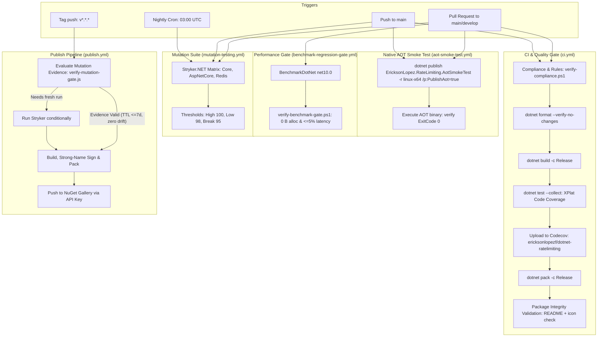

<!-- Copyright © Erickson Lopez. MIT License. -->
# CI/CD Pipeline, Quality Gates & Release Architecture

## 1. Overview & Automation Philosophy

The `EricksonLopez.RateLimiting` CI/CD pipeline enforces enterprise-grade DevSecOps automation, deterministic quality gates, and supply chain security across all supported .NET runtimes (`.NET 8.0`, `.NET 9.0`, and `.NET 10.0`).

All workflows are located in [`.github/workflows/`](../.github/workflows/) and executed on GitHub-hosted `ubuntu-latest` runners.



---

## 2. GitHub Actions Workflows & Tooling

The repository maintains five dedicated GitHub Actions workflows, automated Dependabot maintenance, and pinned SDK governance:

### 2.1. CI & Quality Gate (`ci.yml`)

* **File:** [`.github/workflows/ci.yml`](../.github/workflows/ci.yml)
* **Triggers:**
  * `push` to `main`
  * `pull_request` to `main`
  * `workflow_dispatch` (manual)
* **Environment:**
  * OS: `ubuntu-latest`
  * Timeout: 15 minutes
  * SDKs: .NET 10.0.x SDK primary, with .NET 8.0.x and 9.0.x runtimes installed
* **Execution Steps:**
  1. **Checkout Code:** Deep fetch (`fetch-depth: 0`).
  2. **Setup Runtimes:** Installs .NET 10 SDK and runtimes for .NET 8 and 9.
  3. **Architecture Compliance:** Executes `./scripts/verify-compliance.ps1` to assert kebab-case documentation, zero `[Obsolete]` APIs, canonical MIT headers, One-Type-Per-File invariant, normalized maintainer emails, Native AOT project/workflow gates, README package table parity, and Stryker configuration compliance.
  4. **Code Style Verification:** Runs `dotnet format --verify-no-changes`.
  5. **Restore Dependencies:** Central Package Management restore (`dotnet restore EricksonLopez.RateLimiting.slnx`).
  6. **Build Solution:** Release configuration with strict diagnostics (`TreatWarningsAsErrors=true`, `WarningLevel=5`).
  7. **Execute Test Suites:** Runs all tests across target frameworks with Coverlet code coverage (`--collect:"XPlat Code Coverage"`).
  8. **Upload Coverage:** Transmits coverage reports to Codecov (`codecov/codecov-action@v4`) targeting `ericksonlopezf/dotnet-ratelimiting`.
  9. **Validate NuGet Packaging:** Builds `.nupkg` and `.snupkg` packages into `artifacts/`.
  10. **Package Archive Integrity Verification:** A dedicated PowerShell step unzips all 3 generated `.nupkg` packages in a sandbox directory and asserts the physical presence of `README.md` and `icon.png` inside every package.

### 2.2. Native AOT Smoke Test (`aot-smoke-test.yml`)

* **File:** [`.github/workflows/aot-smoke-test.yml`](../.github/workflows/aot-smoke-test.yml)
* **Triggers:**
  * `push` to `main`
  * `pull_request` to `main`
  * `workflow_dispatch`
* **Execution Steps:**
  1. Sets up .NET 10 SDK.
  2. Restores and publishes the dedicated Native AOT smoke test project:
     ```bash
     dotnet publish tests/EricksonLopez.RateLimiting.AotSmokeTest/EricksonLopez.RateLimiting.AotSmokeTest.csproj -c Release -r linux-x64 --self-contained /p:PublishAot=true -o ./publish-aot
     ```
  3. Executes the compiled Linux AOT executable (`./publish-aot/EricksonLopez.RateLimiting.AotSmokeTest`) verifying that token bucket, sliding window, fixed window, concurrency limiters, ASP.NET Core middleware extensions, and Redis distributed limiters execute with zero runtime trimming reflection failures.

### 2.3. Benchmark Regression Gate (`benchmark-regression-gate.yml`)

* **File:** [`.github/workflows/benchmark-regression-gate.yml`](../.github/workflows/benchmark-regression-gate.yml)
* **Triggers:**
  * `pull_request` targeting `main` or `develop` affecting `src/**` or `benchmarks/**`
  * `workflow_dispatch` with configurable `threshold` input (default: 5%)
* **Secrets Consumed:** `SNK_KEY` (to sign assemblies before benchmarking)
* **Execution Steps:**
  1. Checks out repository and sets up .NET 8, 9, and 10 runtimes.
  2. Restores strong-name key `EricksonLopez.snk` from `secrets.SNK_KEY` if configured.
  3. Builds solution in Release mode.
  4. Runs BenchmarkDotNet against `benchmarks/EricksonLopez.RateLimiting.Benchmarks` targeting `net10.0` with `--job short --exporters json --memory`.
  5. Evaluates `./scripts/verify-benchmark-gate.ps1`:
     * **Heap Allocation Invariant:** Asserts 0 B allocated on all combinators matching `^(Bind|Map|Tap|ZeroAlloc|.*_TState.*)`.
     * **Latency Regression Threshold:** Asserts mean latency does not regress $> 5.0\%$ compared to `benchmarks/results/baseline.json`.
  6. Uploads PR benchmark results as workflow artifact (retained 30 days).

### 2.4. Mutation Testing (`mutation-testing.yml`)

* **File:** [`.github/workflows/mutation-testing.yml`](../.github/workflows/mutation-testing.yml)
* **Triggers:**
  * `push` to `main`
  * `pull_request` to `main`
  * `schedule`: Nightly at `03:00 UTC`
  * `workflow_dispatch` with optional `full-run` boolean input
  * `workflow_call` (invoked conditionally by `publish.yml`)
* **Matrix Strategy:**
  * `Core`: `stryker-core-config.json` -> `src/EricksonLopez.RateLimiting`
  * `AspNetCore`: `stryker-aspnetcore-config.json` -> `src/EricksonLopez.RateLimiting.AspNetCore`
  * `Redis`: `stryker-redis-config.json` -> `src/EricksonLopez.RateLimiting.Redis`
* **Optimizations & Thresholds:**
  * PR Selective Optimization: Compares `git diff origin/main...HEAD`. If a package has no modifications in `src/` or `Directory.*`, mutation testing is skipped for that matrix node during PR evaluation.
  * Uploads HTML and JSON reports as artifacts (retained 14 days).
  * Quality thresholds enforced: High = 100%, Low = 98%, Break = 95%.

### 2.5. Publish NuGet Packages (`publish.yml`)

* **File:** [`.github/workflows/publish.yml`](../.github/workflows/publish.yml)
* **Triggers:**
  * `push` with tags matching `v*.*.*`
  * `workflow_dispatch` with optional version input
* **Secrets Consumed:**
  * `SNK_KEY`: Base64-encoded strong naming key for assembly signing.
  * `NUGET_API_KEY`: API key for publishing to NuGet Gallery.
* **Three-Stage Release Pipeline:**
  1. **Job 1 (`mutation-gate-check`):** Executes `scripts/verify-mutation-gate.js` using `actions/github-script@v7`. Inspects recent commits on `main` for fresh Stryker mutation status. Verifies:
     * Report age does not exceed 7 days (`MAX_REPORT_AGE_DAYS = 7`).
     * Zero production code drift in `src/` between the evaluated commit and target tag commit.
     * Previous mutation score satisfied the break threshold ($\ge 95\%$).
  2. **Job 2 (`stryker-gate`):** If no valid report exists or code drift is detected, conditionally invokes `mutation-testing.yml` before publishing is allowed.
  3. **Job 3 (`publish`):** Restores `EricksonLopez.snk`, builds Release packages, packs `.nupkg` and `.snupkg`, and pushes to NuGet Gallery using `--skip-duplicate`.

---

## 3. Build Configurations & Compiler Governance

### 3.1. SDK Pinning (`global.json`)

The workspace pins the build environment to the .NET 10 SDK with feature band roll forward:
```json
{
  "sdk": {
    "version": "10.0.400",
    "rollForward": "latestFeature"
  }
}
```

### 3.2. Automated Dependency Updates (`dependabot.yml`)

Dependabot monitors dependencies weekly on Monday at 03:00 UTC for both NuGet packages and GitHub Actions.

### 3.3. Compiler Flags & Analysis

Build settings are centrally declared in [`Directory.Build.props`](../Directory.Build.props):

| Property | Setting | Rationale |
|---|---|---|
| `<TargetFrameworks>` | `net8.0;net9.0;net10.0` | Simultaneous multi-targeting for LTS and modern STS runtimes. |
| `<LangVersion>` | `latest` | Unlocks modern C# 13/14 language features (ref structs, primary constructors). |
| `<Nullable>` | `enable` | Compile-time null-safety across all projects. |
| `<TreatWarningsAsErrors>` | `true` | Zero-warning policy across all projects and build configurations. |
| `<WarningLevel>` | `5` | Highest warning level for Roslyn diagnostics. |
| `<AnalysisLevel>` | `latest-recommended` | Enforces Microsoft code analysis rules. |
| `<IsAotCompatible>` | `true` | Enforces Native AOT compiler analysis. |
| `<EnableTrimAnalyzer>` | `true` | Detects IL trimming incompatibilities at compile time. |

### Assembly Strong-Name Signing

Assemblies are strongly signed using `EricksonLopez.snk`:
- Declared in `Directory.Build.props`:
  ```xml
  <SignAssembly Condition="Exists('$(MSBuildThisFileDirectory)EricksonLopez.snk')">true</SignAssembly>
  <AssemblyOriginatorKeyFile Condition="Exists('$(MSBuildThisFileDirectory)EricksonLopez.snk')">$(MSBuildThisFileDirectory)EricksonLopez.snk</AssemblyOriginatorKeyFile>
  <PublicKey Condition="'$(SignAssembly)' == 'true'">0024000004800000940000000602000000240000525341310004000001000100655c867cb6d2e3a8d53e10d858994a49ea6b428de6e1e2eec19c71f0409345a7bf1649e9208282982347d90153f237f1aef003468e4a913598faa0b96815de53ede401790587fef88c7869884cdbf4372e74a44facf7dd6995e9b832285f8c548f531e1886d6712632139b617cd4f13988021b7cc32b5c3af18f52e19ae2a6cc</PublicKey>
  ```
- The public key is propagated automatically to `InternalsVisibleTo` declarations without manual string repetition.

---

## 4. Quality Gates Summary

```
┌────────────────────────────────────────────────────────────────────────┐
│                      REPOSITORY QUALITY GATES                          │
├──────────────────────┬──────────────────────┬──────────────────────────┤
│ Gate                 │ Tool / Mechanism     │ Enforcement Target       │
├──────────────────────┼──────────────────────┼──────────────────────────┤
│ Unit & Adversarial   │ xUnit, AwesomeAssert │ 100% Pass (777 test runs)│
│ Code Coverage        │ Coverlet & Codecov   │ >= 95% Line & Branch     │
│ Native AOT Executable│ dotnet publish AOT   │ 0 Trim Warnings, Exit 0  │
│ Mutation Testing     │ Stryker.NET          │ Break: 95%, High: 100%   │
│ Benchmark Regression │ BenchmarkDotNet      │ 0 B Alloc, <=5% Latency  │
│ Architecture Rules   │ NetArchTest.Rules    │ Sealed types, Tier rules │
│ Compliance Audit     │ verify-compliance.ps1│ MIT headers, kebab-case  │
│ Package Integrity    │ CI PowerShell unarch │ README + icon verification│
└──────────────────────┴──────────────────────┴──────────────────────────┘
```

---

## 5. Branch & Release Strategy

* **Active Branches:**
  * `main`: Production release branch. All PRs must pass CI, benchmark gate, and compliance checks.
  * `develop`: Integration branch evaluated in benchmark regression triggers.
* **Release Flow:**
  1. A Git release tag matching `v*.*.*` (e.g., `v1.0.0`) is pushed to `main`.
  2. `publish.yml` executes `scripts/verify-mutation-gate.js` to assert fresh mutation evidence.
  3. If required, Stryker mutation suite runs across all projects.
  4. Release packages are packed and pushed to NuGet Gallery with `--skip-duplicate`.
