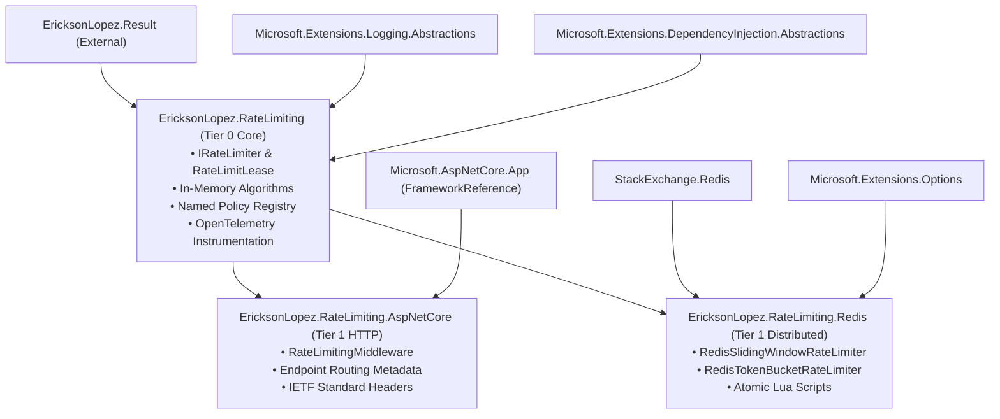

<!-- Copyright © Erickson Lopez. MIT License. -->
# NuGet Packages, Public API Surface & Compatibility Matrix

## 1. Overview & Ecosystem Architecture

`EricksonLopez.RateLimiting` is partitioned into three decoupled NuGet packages adhering to strict single responsibility, zero circular dependencies, and complete Native AOT compatibility.



---

## 2. Published Package Matrix

| Package Identifier | Target Frameworks | Packable | Current Version | Output Artifacts |
|---|---|:---:|:---:|---|
| **`EricksonLopez.RateLimiting`** | `net8.0;net9.0;net10.0` | ✅ `true` | `1.0.0` | `.nupkg`, `.snupkg` |
| **`EricksonLopez.RateLimiting.AspNetCore`** | `net8.0;net9.0;net10.0` | ✅ `true` | `1.0.0` | `.nupkg`, `.snupkg` |
| **`EricksonLopez.RateLimiting.Redis`** | `net8.0;net9.0;net10.0` | ✅ `true` | `1.0.0` | `.nupkg`, `.snupkg` |

---

## 3. Central Package Management (CPM) Reference

All external dependency versions are centrally governed in [`Directory.Packages.props`](../Directory.Packages.props) with `<ManagePackageVersionsCentrally>true</ManagePackageVersionsCentrally>`:

| Dependency Package | Centrally Pinned Version | Consuming Projects | Purpose |
|---|:---:|---|---|
| `Microsoft.SourceLink.GitHub` | `8.0.0` | Global (`Directory.Build.props`) | Git commit SourceLink embedding |
| `EricksonLopez.Result` | `2.0.0` | Core, Redis | Railway-oriented error handling |
| `Microsoft.Extensions.DependencyInjection.Abstractions` | `10.0.11` | Core, Redis | DI service registration abstractions |
| `Microsoft.Extensions.DependencyInjection` | `10.0.11` | Tests, Samples | DI container implementation |
| `Microsoft.Extensions.Logging.Abstractions` | `10.0.11` | Core, Redis | High-performance logging interfaces |
| `Microsoft.Extensions.Logging` | `10.0.11` | Samples | Logging implementation |
| `Microsoft.Extensions.Options` | `10.0.11` | Redis | Strongly typed options pattern |
| `Microsoft.Extensions.TimeProvider.Testing` | `10.1.0` | Tests | `FakeTimeProvider` testability |
| `StackExchange.Redis` | `2.8.47` | Redis | Distributed Redis Lua script execution |
| `System.Threading.RateLimiting` | `10.0.11` | Benchmarks | BCL baseline comparison |
| `Microsoft.NET.Test.Sdk` | `18.9.0` | Tests | Test runner host |
| `xunit` | `2.9.3` | Tests | Unit & adversarial testing framework |
| `xunit.runner.visualstudio` | `4.0.0` | Tests | Test runner adapter |
| `AwesomeAssertions` | `9.6.0` | Tests | Fluent assertions library |
| `NSubstitute` | `5.3.0` | Tests | Mocking framework |
| `NetArchTest.Rules` | `1.3.2` | Tests | Architectural fitness function tests |
| `coverlet.collector` | `10.0.1` | Tests | Cross-platform code coverage collection |
| `BenchmarkDotNet` | `0.15.8` | Benchmarks | Memory and latency micro-benchmarking |

---

## 4. Public API Surface Reference

### 4.1. `EricksonLopez.RateLimiting` (Core)

```csharp
namespace EricksonLopez.RateLimiting
{
    // Contracts & Results
    public interface IRateLimiter
    {
        Task<Result<RateLimitLease>> AcquireAsync(string key, int permits = 1, CancellationToken cancellationToken = default);
    }

    public readonly record struct RateLimitLease(
        bool IsAcquired,
        int RemainingPermits,
        TimeSpan? RetryAfter = null,
        DateTimeOffset? ResetTime = null,
        Action? DisposeAction = null,
        int? Limit = null) : IDisposable
    {
        public void Dispose();
        public void Deconstruct(out bool isAcquired, out int remainingPermits, out TimeSpan? retryAfter, out DateTimeOffset? resetTime);
        public void Deconstruct(out bool isAcquired, out int remainingPermits, out TimeSpan? retryAfter, out DateTimeOffset? resetTime, out Action? disposeAction);
        public static RateLimitLease Successful(int remainingPermits, DateTimeOffset? resetTime = null);
        public static RateLimitLease Successful(int remainingPermits, DateTimeOffset? resetTime, int? limit);
        public static RateLimitLease Successful(int remainingPermits, DateTimeOffset? resetTime, Action? disposeAction);
        public static RateLimitLease Successful(int remainingPermits, DateTimeOffset? resetTime, Action? disposeAction, int? limit);
        public static RateLimitLease Rejected(TimeSpan retryAfter, DateTimeOffset? resetTime = null, int? limit = null);
    }

    public static class RateLimitingErrorCodes
    {
        public const string ConnectionFailedCode = "RateLimit.Redis.ConnectionFailed";
    }

    // Limiters & Options
    public sealed class RateLimiterOptions
    {
        public int PermitLimit { get; set; }        // Default: 100
        public TimeSpan Window { get; set; }        // Default: 1 minute
        public int SegmentsPerWindow { get; set; }  // Default: 6
        public int MaxPartitions { get; set; }      // Default: 10,000 (v1.0.0 DoS defense)
    }

    public sealed class ConcurrencyRateLimiterOptions
    {
        public int PermitLimit { get; set; }        // Default: 10
        public int MaxPartitions { get; set; }      // Default: 10,000 (v1.0.0 DoS defense)
    }

    public sealed class SlidingWindowRateLimiter : IRateLimiter { ... }
    public sealed class TokenBucketRateLimiter : IRateLimiter { ... }
    public sealed class FixedWindowRateLimiter : IRateLimiter { ... }
    public sealed class ConcurrencyRateLimiter : IRateLimiter { ... }
    public sealed class CompositeRateLimiter : IRateLimiter { ... }

    // OpenTelemetry Metrics
    public static class RateLimitingMetrics
    {
        public const string MeterName = "EricksonLopez.RateLimiting";
        public const string MeterVersion = "1.0.0";
        public static readonly Counter<long> RequestsTotal;
        public static readonly Histogram<double> LeaseDuration;
        public static void RecordRequest(string limiterType, string status, double durationMs);
    }

    // DI Extensions
    public static class RateLimitingServiceCollectionExtensions
    {
        public static IServiceCollection AddSlidingWindowRateLimiter(this IServiceCollection services, Action<RateLimiterOptions> configure);
        public static IServiceCollection AddTokenBucketRateLimiter(this IServiceCollection services, Action<RateLimiterOptions> configure);
        public static IServiceCollection AddFixedWindowRateLimiter(this IServiceCollection services, Action<RateLimiterOptions> configure);
        public static IServiceCollection AddConcurrencyRateLimiter(this IServiceCollection services, Action<ConcurrencyRateLimiterOptions> configure);
        public static IServiceCollection AddCompositeRateLimiter(this IServiceCollection services, params IRateLimiter[] limiters);
    }
}

namespace EricksonLopez.RateLimiting.Policies
{
    public interface IRateLimiterPolicy
    {
        string Name { get; }
        IRateLimiter Limiter { get; }
    }

    public interface IRateLimiterPolicyRegistry
    {
        IRateLimiter? DefaultLimiter { get; }
        IRateLimiter? GetPolicy(string name);
    }

    public sealed class RateLimiterPolicyBuilder
    {
        public RateLimiterPolicyBuilder AddFixedWindow(string name, Action<RateLimiterOptions> configure, TimeProvider? timeProvider = null);
        public RateLimiterPolicyBuilder AddSlidingWindow(string name, Action<RateLimiterOptions> configure, TimeProvider? timeProvider = null);
        public RateLimiterPolicyBuilder AddTokenBucket(string name, Action<RateLimiterOptions> configure, TimeProvider? timeProvider = null);
        public RateLimiterPolicyBuilder AddConcurrency(string name, Action<ConcurrencyRateLimiterOptions> configure);
        public RateLimiterPolicyBuilder AddComposite(string name, params IRateLimiter[] limiters);
        public RateLimiterPolicyBuilder AddPolicy(string name, IRateLimiter limiter);
        public RateLimiterPolicyBuilder SetDefaultPolicy(string name);
        public RateLimiterPolicyBuilder SetDefaultPolicy(IRateLimiter limiter);
        public IRateLimiterPolicyRegistry Build();
    }
}
```

### 4.2. `EricksonLopez.RateLimiting.AspNetCore`

```csharp
namespace EricksonLopez.RateLimiting.AspNetCore
{
    public sealed class RateLimitingMiddlewareOptions
    {
        public Func<HttpContext, string> PartitionKeyResolver { get; set; }
        public int PermitCost { get; set; }
        public bool FailClosed { get; set; }
        public Func<HttpContext, RateLimitLease, CancellationToken, Task>? OnRejected { get; set; }
        public Func<HttpContext, Error, CancellationToken, Task>? OnRedisFailure { get; set; }
    }

    public static class RateLimitingHeaders
    {
        public const string Limit = "X-RateLimit-Limit";
        public const string Remaining = "X-RateLimit-Remaining";
        public const string Reset = "X-RateLimit-Reset";
        public const string RetryAfter = "Retry-After";
    }

    [AttributeUsage(AttributeTargets.Class | AttributeTargets.Method, AllowMultiple = false, Inherited = true)]
    public sealed class EnableRateLimitingAttribute(string policyName) : Attribute, IEnableRateLimitingMetadata;

    [AttributeUsage(AttributeTargets.Class | AttributeTargets.Method, AllowMultiple = false, Inherited = true)]
    public sealed class DisableRateLimitingAttribute : Attribute, IDisableRateLimitingMetadata;

    public static class EndpointRateLimitingExtensions
    {
        public static TBuilder RequireDistributedRateLimiting<TBuilder>(this TBuilder builder, string policyName) where TBuilder : IEndpointConventionBuilder;
        public static TBuilder DisableDistributedRateLimiting<TBuilder>(this TBuilder builder) where TBuilder : IEndpointConventionBuilder;
    }

    public static class RateLimitingAspNetCoreExtensions
    {
        public static IServiceCollection AddHttpRateLimiting(this IServiceCollection services, Action<RateLimitingMiddlewareOptions>? configure = null);
        public static IServiceCollection AddRateLimiting(this IServiceCollection services, Action<RateLimiterPolicyBuilder> configure, Action<RateLimitingMiddlewareOptions>? configureMiddleware = null);
        public static IApplicationBuilder UseHttpRateLimiting(this IApplicationBuilder app);
    }
}
```

### 4.3. `EricksonLopez.RateLimiting.Redis`

```csharp
namespace EricksonLopez.RateLimiting.Redis
{
    public sealed class RedisRateLimiterOptions
    {
        public string Configuration { get; set; }       // Default: "localhost:6379,abortConnect=false"
        public string KeyPrefix { get; set; }           // Default: "rl:"
        public TimeSpan WindowDuration { get; set; }    // Default: 1 minute
        public int MaxPermits { get; set; }             // Default: 100
        public int Database { get; set; }               // Default: 0
    }

    public sealed class RedisTokenBucketRateLimiterOptions
    {
        public string Configuration { get; set; }       // Default: "localhost:6379,abortConnect=false"
        public string KeyPrefix { get; set; }           // Default: "rl:tb:"
        public int TokenLimit { get; set; }             // Default: 100
        public int TokensPerPeriod { get; set; }        // Default: 10
        public TimeSpan ReplenishmentPeriod { get; set; }// Default: 1 second
        public int Database { get; set; }               // Default: 0
    }

    public sealed class RedisSlidingWindowRateLimiter : IRateLimiter { ... }
    public sealed class RedisTokenBucketRateLimiter : IRateLimiter { ... }

    public static class RateLimitingRedisServiceCollectionExtensions
    {
        public static IServiceCollection AddRedisRateLimiting(this IServiceCollection services, Action<RedisRateLimiterOptions> configure);
        public static IServiceCollection AddRedisRateLimiting(this IServiceCollection services, IConnectionMultiplexer connectionMultiplexer, Action<RedisRateLimiterOptions>? configure = null);
        public static IServiceCollection AddRedisTokenBucketRateLimiting(this IServiceCollection services, Action<RedisTokenBucketRateLimiterOptions> configure);
        public static IServiceCollection AddRedisTokenBucketRateLimiting(this IServiceCollection services, IConnectionMultiplexer connectionMultiplexer, Action<RedisTokenBucketRateLimiterOptions>? configure = null);
    }
}
```

---

## 5. Compatibility Matrix

| Runtime / Platform | `EricksonLopez.RateLimiting` | `EricksonLopez.RateLimiting.AspNetCore` | `EricksonLopez.RateLimiting.Redis` |
|---|:---:|:---:|:---:|
| **.NET 10 (LTS)** | ✅ Fully Supported | ✅ Fully Supported | ✅ Fully Supported |
| **.NET 9 (STS)** | ✅ Fully Supported | ✅ Fully Supported | ✅ Fully Supported |
| **.NET 8 (LTS)** | ✅ Fully Supported | ✅ Fully Supported | ✅ Fully Supported |
| **Native AOT** | ✅ 100% Certified | ✅ 100% Certified | ✅ 100% Certified |
| **Assembly Trimming** | ✅ Trim-Safe | ✅ Trim-Safe | ✅ Trim-Safe |
| **Linux (x64, arm64)** | ✅ Supported | ✅ Supported | ✅ Supported |
| **Windows (x64, arm64)** | ✅ Supported | ✅ Supported | ✅ Supported |
| **macOS (x64, arm64)** | ✅ Supported | ✅ Supported | ✅ Supported |

> [!NOTE]
> Native AOT compatibility is certified via continuous automated compilation and execution of `tests/EricksonLopez.RateLimiting.AotSmokeTest` in [`.github/workflows/aot-smoke-test.yml`](../.github/workflows/aot-smoke-test.yml).

---

## 6. Runnable Samples Catalog

The repository provides five standalone, runnable sample projects demonstrating real-world integration patterns:

1. **[`SlidingWindow.Sample`](../samples/SlidingWindow.Sample)**: Demonstrates in-memory sliding window rate limiting in an ASP.NET Core API with route-level exemption.
2. **[`Redis.MultiTenant.Sample`](../samples/Redis.MultiTenant.Sample)**: Demonstrates distributed Redis rate limiting partitioned dynamically across Tenant ID (`X-Tenant-Id`), JWT Subject ID, and client IP address.
3. **[`FailOpen.Sample`](../samples/FailOpen.Sample)**: Demonstrates high-availability degradation with simulated Redis network outages, `OnRedisFailure` callbacks, diagnostic headers, and RFC 7807 ProblemDetails.
4. **[`NamedPolicies.Sample`](../samples/NamedPolicies.Sample)**: Demonstrates named policies orchestrated via `RateLimiterPolicyBuilder`, endpoint routing conventions, and default fallback policies.
5. **[`Showcase`](../samples/Showcase)**: Comprehensive showcase application demonstrating all limiters, custom limiter implementations (`ShowcaseCustomLimiter`), and live traffic simulations.
