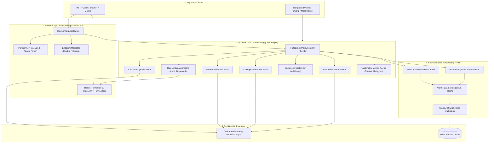
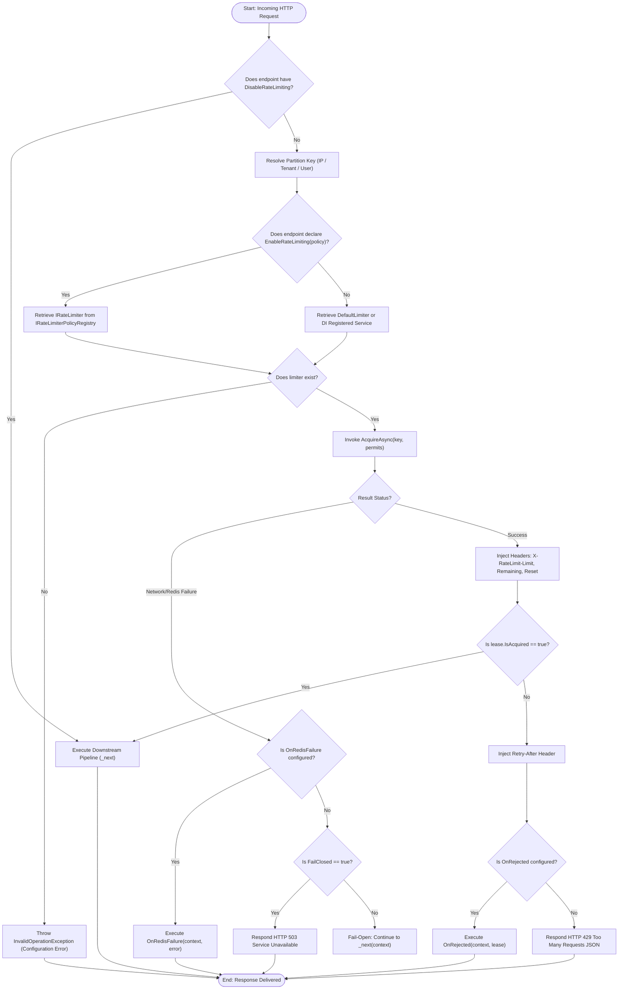
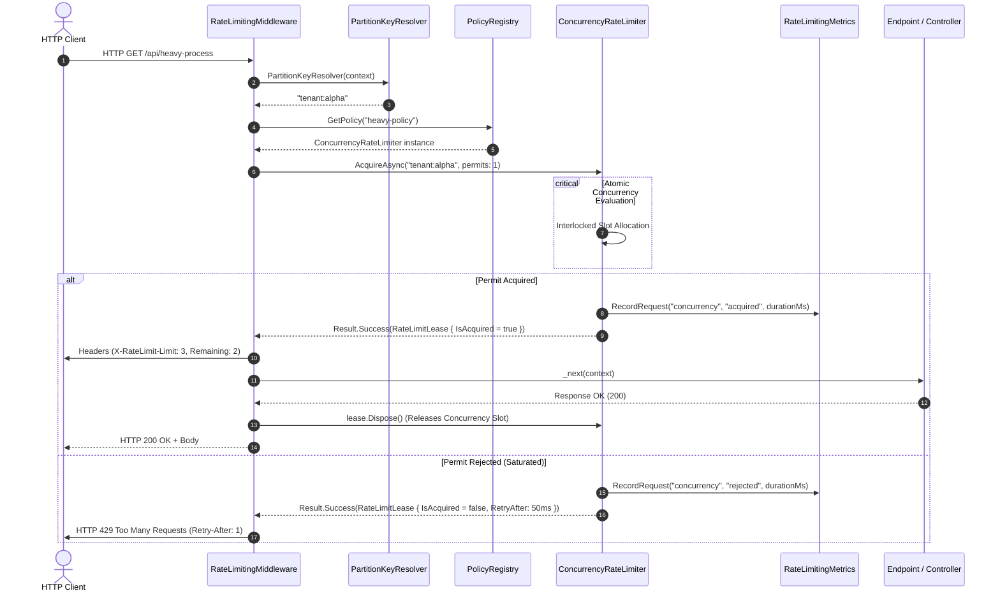
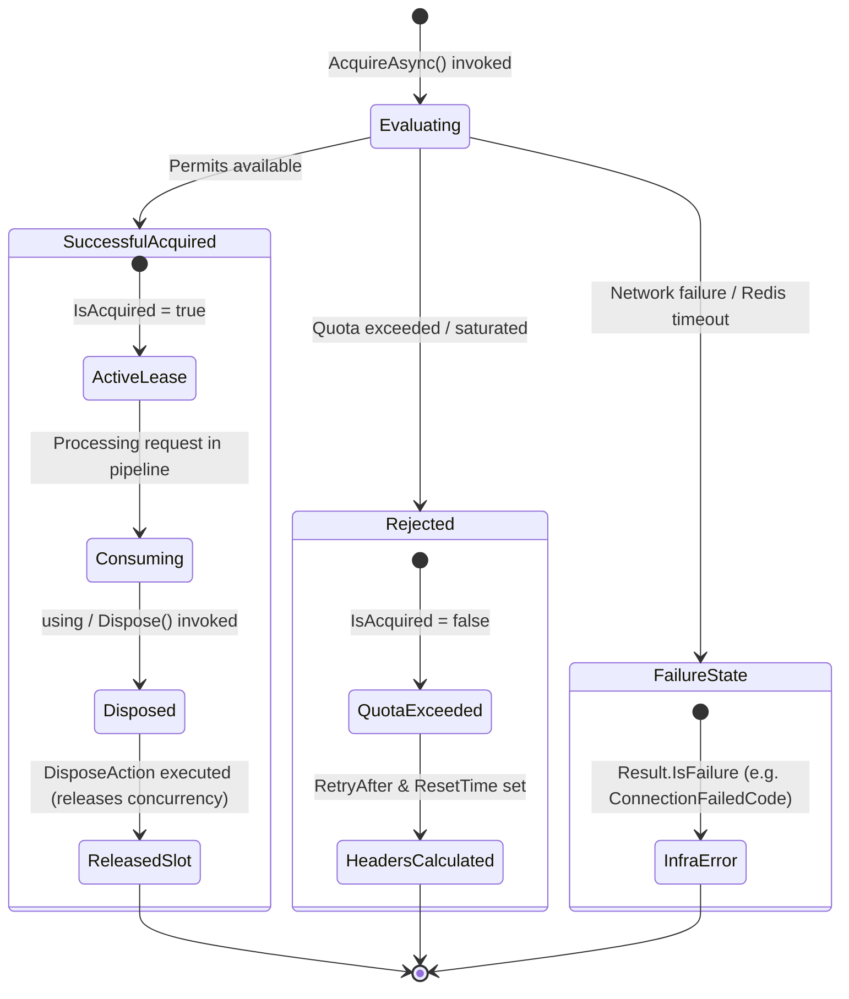
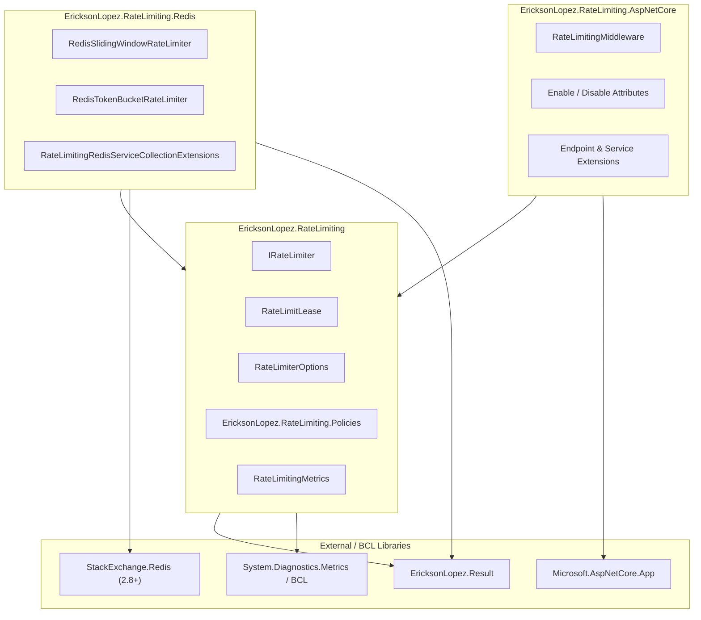
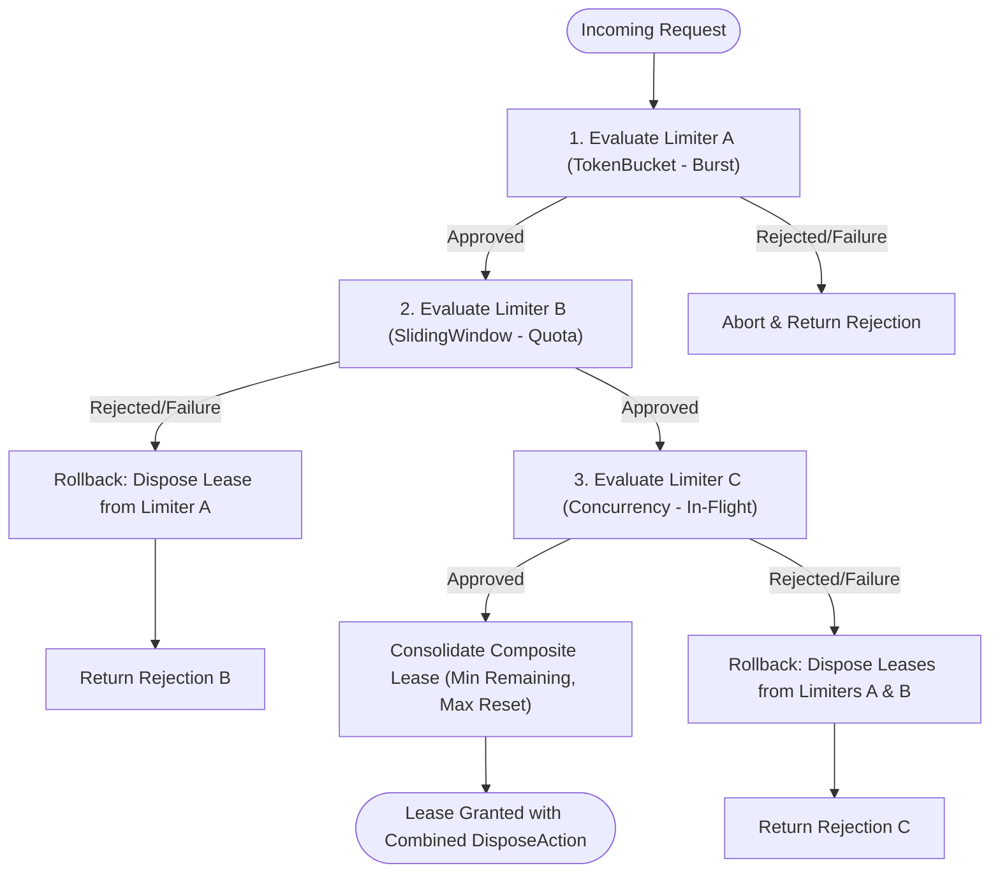

# Phase 7 · System Architectural Diagrams (Mermaid)

This document contains the official Mermaid diagrams reflecting the actual architecture and operational flows of `EricksonLopez.RateLimiting`.

---

## 1. General Architectural Diagram

---

## 2. Main Request Flow Diagram (HTTP Request Evaluation)

---

## 3. Sequence Diagram (Component Interaction Under Concurrency)

---

## 4. `RateLimitLease` State Lifecycle Diagram

---

## 5. Solution Dependency Diagram

---

## 6. CompositeRateLimiter Pipeline Diagram (Transactional Rollback)

